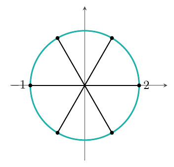
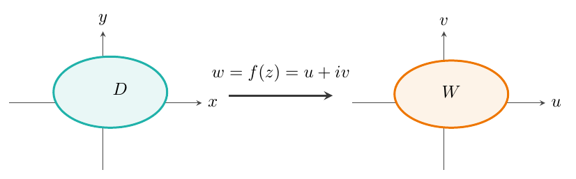

## 复数与复变函数

### 复数

#### 复数及运算

> **定义**
>
> 虚数单位 $i$：方程 $x^{2}+1=0$ 的根 $\pm i$.

> **定义**
>
> 复数：$z=x+iy$, $x,y$ 均为实数.
>
>
> $x$ 称为 $z$ 的实部, 记作 $\operatorname{Re}z$, $y$ 称为 $z$ 的虚部, 记作 $\operatorname{Im}z$.

> **定义**
>
> 共轭复数：$z=x+iy$ 与 $\overline{z}=x-iy$ 互为共轭复数.

> **定义**
>
> 复数的模与辐角
>
>
> 在 $xOy$ 坐标系中的点 $(x,y)$ 与复数 $z=x+iy$ 建立一一对应, 故 $xOy$ 坐标平面也可称为复平面, 复数 $z=x+iy$ 与向量 $\overrightarrow{OZ}$ 一一对应.
>
>
> 复数的模：$z=x+iy$ 的模 $|z|$ 记作 $r=\sqrt{x^{2}+y^{2}}=|\overrightarrow{OZ}|$.
>
>
> 复数的辐角：$\overrightarrow{OZ}$ 与 $x$ 轴的正向的夹角 $\theta$ 称为 $z$ 的辐角, 记作 $\operatorname{Arg}z$. $\operatorname{Arg}z=\arg z+2k\pi$, $k=0,\pm1,\cdots$ ($z=0$ 无辐角). 这里 $\arg z$ 指辐角主值, 经常这样规定：$-\pi<\arg z\leq\pi$，或 $0<\arg z\leq 2\pi$. 例如,
> $$
> \begin{aligned}
> z=1+i&\colon \arg z=\frac{\pi}{4},\quad
> \operatorname{Arg}z=\frac{\pi}{4}+2k\pi,\ k=0,\pm1,\cdots,\\
> z=1-i&\colon \arg z=-\frac{\pi}{4}\ \Bigl(\text{或 }\arg z=\frac{7\pi}{4}\Bigr),\quad
> \operatorname{Arg}z=\frac{7\pi}{4}+2k\pi.
> \end{aligned}
> $$

> **例**
>
> 已知 $z=x+iy$, 则 $(-\pi<\arg z\leq\pi)$:
> $$
> \arg z=
> \begin{cases}
> \arctan\frac{y}{x}, & x>0 \\[4pt]
> \arctan\frac{y}{x}+\pi, & x<0,\ y\geq 0 \\[4pt]
> \arctan\frac{y}{x}-\pi, & x<0,\ y<0 \\[4pt]
> \frac{\pi}{2}, & x=0,\ y>0 \\[4pt]
> -\frac{\pi}{2}, & x=0,\ y<0.
> \end{cases}
> $$

#### 复数的四则运算

设 $z_{1}=x_{1}+iy_{1}$, $z_{2}=x_{2}+iy_{2}$, 则：

- $z_{1}\pm z_{2}=(x_{1}\pm x_{2})+i(y_{1}\pm y_{2})$.
- $z_{1}\cdot z_{2}=(x_{1}+iy_{1})(x_{2}+iy_{2})=(x_{1}x_{2}-y_{1}y_{2})+i(x_{1}y_{2}+x_{2}y_{1})$.
- $\displaystyle\frac{z_{1}}{z_{2}}=\frac{x_{1}+iy_{1}}{x_{2}+iy_{2}}=\frac{(x_{1}x_{2}+y_{1}y_{2})+i(x_{2}y_{1}-x_{1}y_{2})}{x_{2}^{2}+y_{2}^{2}}$.

特别地, $z=x+iy$, $z\cdot\overline{z}=x^{2}+y^{2}$.

> **例**
>
> 设 $|z_{0}|<1$, 若 $|z|<1$, 则 $\bigl|\frac{z-z_{0}}{1-\overline{z_{0}}\cdot z}\bigr|<1$.
>
>
>
> > **证明**
> >
> > $$
> > \Bigl|\frac{z-z_{0}}{1-\overline{z_{0}}\cdot z}\Bigr|<1
> > \Leftrightarrow |z-z_{0}|^{2}<|1-\overline{z_{0}}\cdot z|^{2}
> > $$
> > $$
> > \Leftrightarrow (z-z_{0})(\overline{z}-\overline{z_{0}})<(1-\overline{z_{0}}z)(1-z_{0}\overline{z})
> > $$
> > $$
> > \Leftrightarrow z\overline{z}+z_{0}\overline{z_{0}}-z\overline{z_{0}}-z_{0}\overline{z}
> > <1-z_{0}\overline{z}-\overline{z_{0}}z+z_{0}\overline{z_{0}}z\overline{z}
> > $$
> > $$
> > \Leftrightarrow 1-|z|^{2}-|z_{0}|^{2}+|z|^{2}|z_{0}|^{2}>0
> > $$
> > $$
> > \Leftrightarrow (1-|z_{0}|^{2})(1-|z|^{2})>0.
> > $$
> > 当 $|z_{0}|<1$, $|z|<1$ 时上式成立, 故原式成立.
>

> **注**
>
> 例2的结论：
>
> 1. 设 $|z_{0}|<1$, 若 $|z|>1$, 则 $\bigl|\frac{z-z_{0}}{1-\overline{z_{0}}z}\bigr|>1$.
> 1. 设 $|z_{0}|<1$, 若 $|z|=1$, 则 $\bigl|\frac{z-z_{0}}{1-\overline{z_{0}}z}\bigr|=1$.
>
> 综上得, 变换 $w=\frac{z-z_{0}}{1-\overline{z_{0}}z}\ (|z_{0}|<1)$ 将单位圆 $|z|<1$ 变为 $|w|<1$.
>
>
> 单位圆周 $|z|=1$ 变为 $|w|=1$, 外部 $|z|>1$ 变为 $|w|>1$.
>
>
> 问题：$w=\dfrac{z-z_{0}}{1-\overline{z_{0}}z}$ 是否将 $z$ 平面正好变换为 $w$ 平面？

#### 复数的表示形式

1. $z=x+iy$: 代数形式.
1. $z=r\cos\theta+ir\sin\theta$: 三角形式, $r=|z|$, $\theta=\arg z$.
1. $z=r(\cos\theta+i\sin\theta)=re^{i\theta}$: 指数形式.

> **注**
>
> 指数形式表明复数的乘、除运算满足指数运算律：
> $$
> z_{1}=r_{1}e^{i\theta_{1}},\ z_{2}=r_{2}e^{i\theta_{2}},\quad
> z_{1}\cdot z_{2}=r_{1}r_{2}e^{i(\theta_{1}+\theta_{2})},\quad
> \frac{z_{1}}{z_{2}}=\frac{r_{1}}{r_{2}}e^{i(\theta_{1}-\theta_{2})}.
> $$

例如, $1+i=\sqrt{2}e^{i\frac{\pi}{4}}$, $1-i=\sqrt{2}e^{i(-\frac{\pi}{4})}=\sqrt{2}e^{i\frac{7\pi}{4}}$.

于是有：$e^{i(\theta+2k\pi)}=e^{i\theta}$, $k=0,\pm1,\cdots$

#### 复数的乘幂与方根

1. 乘幂：$w=z^{n}$, $z^{n}=(x+iy)^{n}=r^{n}(\cos\theta+i\sin\theta)^{n}=r^{n}e^{in\theta}$.

  特别地, 棣莫弗公式 (De Moivre):
  $$
  (\cos\theta+i\sin\theta)^{n}=\cos n\theta+i\sin n\theta.
  $$
  Cor.
  $$
  \cos3\theta=\cos^{3}\theta-3\cos\theta\sin^{2}\theta,\quad
  \sin3\theta=3\cos^{2}\theta\sin\theta-\sin^{3}\theta,
  $$
  $$
  (\cos\theta+i\sin\theta)^{3}
  =\cos^{3}\theta+3i\cos^{2}\theta\sin\theta-3\cos\theta\sin^{2}\theta-i\sin^{3}\theta.
  $$

1. 方根：复数 $z$ 的 $n$ 次方根即方程 $z=w^{n}$ 的根.

  即求 $w=\rho e^{i\varphi}$ 满足 $z=w^{n}$:
  $$
  re^{i\theta}=\rho^{n}e^{in\varphi}\ \Rightarrow\ \rho=\sqrt[n]{r},\quad
  \varphi=\frac{\theta+2k\pi}{n},\ k=0,\pm1,\cdots
  $$
  $$
  \sqrt[n]{z}=\sqrt[n]{|z|}\,e^{\frac{\theta+2k\pi}{n}i},\quad k=0,1,\cdots,n-1.
  $$
  记 $w_{k}=(\sqrt[n]{z})_{k}=\sqrt[n]{|z|}\,e^{i\frac{\theta+2k\pi}{n}}$, $k=0,1,\cdots,n-1$.

> **定理**
>
> 一个非零复数 $z=re^{i\theta}$ 的 $n$ 次方根有 $n$ 个值 ($f(z)=\sqrt[n]{z}$), 这 $n$ 个方根均匀落在
> $w$ 平面中半径为 $\sqrt[n]{r}$ 的圆周 $|w|=\sqrt[n]{r}$ 上.

> **例**
>
> $\sqrt[3]{-1}=e^{i\frac{\pi+2k\pi}{3}}$, $k=0,1,2$; 
> $\sqrt[3]{8}=2e^{i\frac{2k\pi}{3}}$, $k=0,1,2$.

> **例**
>
> 方程 $z^{4}+a^{4}=0\ (a>0)$ 的根: $z_{k}=ae^{i\frac{\pi+2k\pi}{4}}$, $k=0,1,2,3$.

### 复平面上的点集及曲线

#### 复平面上点集

在 $xOy$ 平面上, 点 $(x,y)$ 与一个复数 $z=x+iy$ 及向量 $\overrightarrow{Oz}$ 建立一一对应, 故 $xOy$ 平面称为复平面, $x$ 轴称为实轴, $y$ 轴称为虚轴.

下面给出复平面上有关点集的基本概念：

> **定义**
>
> $N_{\rho}(z_{0})=\{z\mid|z-z_{0}|<\rho\}$ 称为以 $z_{0}$ 为中心, $\rho$ 为半径的邻域.
>
>
> 其余 11 个概念可由邻域定义：内点、开集、边界点及边界、闭集、连通集、开区域、闭区域、有界点集、点集的直径、聚点、孤立点.
>
>
> 上述概念的定义完全类似二维空间中点集的概念.

#### 复数域的完备性定理

闭区域套定理, 柯西收敛准则, 致密性定理, 有限覆盖定理, 聚点定理.

#### 复数点列的收敛性

1. $\{z_{n}\}\to z_{0}\Longleftrightarrow\forall\varepsilon>0,\exists N>0$, $n>N$ 时 $|z_{n}-z_{0}|<\varepsilon$.
1. $\{z_{n}\}$ 收敛 $\Leftrightarrow$ $\forall\varepsilon>0,\exists N>0$, $n,m>N$ 时 $|z_{n}-z_{m}|<\varepsilon$.
1. 设 $z_{n}=x_{n}+iy_{n}$, 则 $z_{n}\to z_{0}=x_{0}+iy_{0}\Leftrightarrow x_{n}\to x_{0}, y_{n}\to y_{0}$.

#### 复平面上的曲线

在 $xOy$ 平面中, 曲线参数方程为 $L:\begin{cases}x=x(t)\\y=y(t)\end{cases},\ t\in I$. 对应在复平面上, 一般形式为 $z=x(t)+iy(t),\ t\in I$, 这里 $x(t),y(t)$ 均为实变量实函数.

> **定义**
>
> 若曲线 $L:z=z(t)=x(t)+iy(t)$ 中 $x(t)$ 与 $y(t)$ 都连续, 则称曲线 $L$ 是连续曲线.

> **定义**
>
> 无重点的连续曲线称为简单曲线 (Jordan 曲线).
>
>
> 曲线的重点：曲线的参数方程中不同参数对应于同一点, 这种点称为曲线的重点.

> **定义**
>
> 在曲线的参数方程 $z=z(t)=x(t)+iy(t)$ 中, 当 $x'(t)$ 和 $y'(t)$ 都连续且 $x'^{2}(t)+y'^{2}(t)\neq0$, 则称 $L$ 是光滑曲线.

> **命题**
>
> 光滑曲线一定可求长.
>
>
> 弧长 $S=\int_{\alpha}^{\beta}\sqrt{x'^{2}(t)+y'^{2}(t)}\,dt=\int_{\alpha}^{\beta}|z'(t)|\,dt$.

#### 常见平面曲线

1. 直线方程：过两点 $z_{1},z_{2}$ 的直线方程 $z=z_{1}+(z_{2}-z_{1})t$, $t\in\mathbb{R}$.
1. 圆弧方程: $z=z_{0}+Re^{i\theta}$, $0\leq\theta<2\pi$.

  其他形式：$|z-z_{0}|=R$, 或 $z\overline{z}+\overline{\beta}z+\beta\overline{z}+C=0$, 这里 $C$ 为实数, 满足 $|\beta|^{2}>C$, 表示以 $-\beta$ 为圆心, $\sqrt{|\beta|^{2}-C}$ 为半径的圆.

### 复变函数

#### 复变函数定义及表示形式

> **定义**
>
> 设 $D$ 是复平面 $z$ 上的一个复数集, $W$ 是复平面 $w$ 上的一个复数集, 称 $D$ 到 $W$ 上的映射 $f$ 为定义在 $D$ 上的一个复变函数, 记为 $w=f(z)$, $z\in D$, $w\in W$.
>
>
> $D$ 称为 $f$ 的定义域, $f(D)\subset W$, $f(D)$ 称为值域.
>
>
> 例如, $f(z)=z^{2},\ z\in D$; $f(z)=\overline{z}$; $f(z)=\sqrt[n]{z}$ (多值);
>
>
> $f(z)=\arg z$ (单值); $f(z)=\operatorname{Arg}z$ (多值).

> **注**
>
> 复变函数可以是复变量的实值函数或实变量的复(或实)函数.

#### 复变函数的几种表示形式

1. $w=f(z)=u(z)+iv(z)$, 这里 $u,v$ 是两个复变量实函数.
1. $w=f(z)=u(x,y)+iv(x,y)$, 这里 $u,v$ 是两个实变量实函数.
1. $w=f(z)=u(r,\theta)+iv(r,\theta)$.

#### 复变函数的几何意义

映射.

#### 复变函数的极限

> **定义**
>
> 设 $z_{0}$ 是 $f(z)$ 定义域 $D$ 中的一个聚点, 若有一个 $A\in\mathbb{C}$ 使得 $\forall\varepsilon>0$, $\exists\delta>0$, 当 $|z-z_{0}|<\delta$ 且 $z\in D$ 时满足 $|f(z)-A|<\varepsilon$, 则称 $f(z)$ 当 $z\to z_{0}$, $z\in D$ 时收敛于 $A$, 记作 $\lim_{z\to z_{0},\,z\in D}f(z)=A$.

#### 复变函数的连续性

> **定义**
>
> 若 $\lim_{z\to z_{0},z\in D}f(z)=f(z_{0})$, 则称 $f(z)$ 在 $z_{0}$ 点连续.

> **定义**
>
> 若 $f(z)$ 在 $D$ 上处处连续, 则称 $f(z)$ 是 $D$ 上的连续函数.

> **注**
>
> 复变函数 $f(z)$ 的定义域经常选为区域或闭区域.
>
>
> 例如, $|z|<1$, $1<|z|<2$ 称为区域; $|z|\leq1$, $1\leq|z|\leq2$ 称为闭区域.

连续的四则运算和复合函数的连续性都成立.

1. $f(z)$ 连续 $\Rightarrow$ $|f(z)|$ 连续.
1. $f(z)$ 连续 $\Leftrightarrow$ $\overline{f(z)}$ 连续, $|f(z)|=\sqrt{f(z)\overline{f(z)}}$.
1. $f(z)=u(z)+iv(z)$ 连续 $\Leftrightarrow$ $u(z),v(z)$ 均连续.
1. $f(z)=u(x,y)+iv(x,y)$ 连续 $\Leftrightarrow$ $u(x,y),v(x,y)$ 均连续.

> **定理**
>
> 若 $f(z)$ 在有界闭区域 $D$ 上连续, 则:
>
> 1. $|f(z)|$ 有界.
> 1. $|f(z)|$ 存在最大、最小值.
> 1. $|f(z)|$ 能取到介于 $\max|f(z)|$ 与 $\min|f(z)|$ 间任意值.
> 1. $f(z)$ 和 $|f(z)|$ 都在 $D$ 上一致连续.
>

### 复球面与扩充复平面

#### 复平面与球面的对应

在复平面上放一个与其相切的球面, 球面上最上方的点称为 (北) 极点, 记为 $N$. 平面上任一点 $z$ 与 $N$ 的连线, 线段与球面有唯一交点 $P$. 这样 $z$ 上的点与球面上除 $N$ 外任意点建立一一对应.

规定 $N$ 点也对应一个点, 记为 $\infty$. 于是球面与复平面含 $\infty$ 建立一一对应. 记复平面与 $\infty$ 的并集为扩充复平面, 即扩充复平面 $\Leftrightarrow$ 复球面.

#### 关于 $\infty$ 的说明

1. 几何意义：在复平面上 $\infty$ 可看成一个点, 例如直线经过 $\infty$, 半平面不含 $\infty$. $D:\lvert z\rvert>1$ 含 $\infty$, $\infty$ 被看作无界区域的边界点.
1. $\infty$ 的运算性质:
  $$
  a\pm\infty=\infty,\ a\cdot\infty=\infty\ (a\neq0),\quad
  \frac{a}{\infty}=0,\ \frac{a}{0}=\infty\ (a\neq0),\ \infty\cdot\infty=\infty.
  $$
1. 注意: $\infty\pm\infty$、$0\cdot\infty$、$\frac{0}{0}$、
  $\frac{\infty}{\infty}$ 等是不定式.
1. $|\infty|=+\infty$: 广义实数.
1. $z\to\infty\Leftrightarrow|z|\to+\infty$.
1. 若 $\lim_{z\to\infty}f(z)=A$, 可记为 $f(\infty)=A$.

[目录与前言](../viewer.html?md=Complex-Analysis-Notes) · [下一章 →](../viewer.html?md=Complex-Analysis-Notes-Chapter-2)
