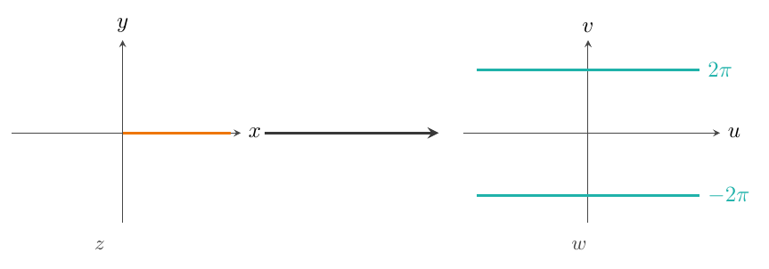

[← 上一章](../viewer.html?md=Complex-Analysis-Notes-Chapter-1)

## 解析函数

### 解析函数及 C-R 条件

#### 复变函数可导与可微

> **定义**
>
> 设 $f(z)$ 在 $z_{0}$ 的某邻域内有定义, 记 $\Delta z=z-z_{0}$, $\Delta w=f(z)-f(z_{0})=f(z_{0}+\Delta z)-f(z_{0})$. 若 $\lim_{\Delta z\to0}\frac{\Delta w}{\Delta z}$ 存在, 则称 $f(z)$ 在 $z_{0}$ 处可导, 记为在 $z_{0}$ 处的导数,
> $$
> f'(z_{0})=\lim_{\Delta z\to0}\frac{\Delta w}{\Delta z}=\lim_{z\to z_{0}}\frac{f(z)-f(z_{0})}{z-z_{0}}.
> $$

> **定义**
>
> 若 $f(z)$ 在 $z_{0}$ 可导, 也称 $f(z)$ 在 $z_{0}$ 可微, 且微分 $dw=f'(z_{0})\Delta z$ 记作 $f'(z_{0})\,dz$.

> **定理**
>
> $f(z)$ 在 $z_{0}$ 可微 (可导) $\Leftrightarrow \Delta w=f'(z_{0})\Delta z+o(|\Delta z|)$.

> **证明**
>
> $\frac{\Delta w}{\Delta z}\to f'(z_{0})
> \Leftrightarrow \Delta w=f'(z_{0})\Delta z+\varepsilon\cdot\Delta z
> \Leftrightarrow \Delta w=f'(z_{0})\Delta z+o(|\Delta z|)$.

> **注**
>
> $o(|\Delta z|)=o(\Delta z)$.

与实函数求导法则类似, 复变函数的导数也有四则运算及复合函数求导法则:
$$
(f(z)+g(z))'=f'(z)+g'(z),\quad
(f(z)\cdot g(z))'=f'(z)g(z)+f(z)g'(z),
$$
$$
\Bigl(\frac{f(z)}{g(z)}\Bigr)'=\frac{f'(z)g(z)-f(z)g'(z)}{g^{2}(z)}.
$$

> **例**
>
> 证明 $f(z)=z^{n}$ 在 $z$ 平面上处处可导, 且 $f'(z)=nz^{n-1}$.
>
>
>
> > **证明**
> >
> > $\forall z$, $\Delta w=f(z+\Delta z)-f(z)$,
> > $$
> > f'(z)=\lim_{\Delta z\to0}\frac{(z+\Delta z)^{n}-z^{n}}{\Delta z}
> > =\lim_{\Delta z\to0}\frac{nz^{n-1}\Delta z+\binom{n}{2}z^{n-2}(\Delta z)^{2}+\cdots+(\Delta z)^{n}}{\Delta z}=nz^{n-1}.
> > $$
>

> **例**
>
> 证明 $f(z)=\overline{z}$ 在全平面上处处不可导.
>
>
>
> > **证明**
> >
> > $\forall z$, $\Delta w=f(z+\Delta z)-f(z)=\overline{z+\Delta z}-\overline{z}=\overline{\Delta z}$,
> > $$
> > \frac{\Delta w}{\Delta z}=\frac{\overline{\Delta z}}{\Delta z}
> > =\frac{re^{-i\theta}}{re^{i\theta}}=e^{-2i\theta}.
> > $$
> > $\lim_{\Delta z\to0}\frac{\Delta w}{\Delta z}$ 不存在 (与路径 $\theta$ 有关).
>

#### 解析函数

> **定义**
>
> 若 $f(z)$ 在区域 $D$ 上处处可导, 则称 $f(z)$ 在区域 $D$ 上解析, 也称 $f(z)$ 是区域 $D$ 上的解析函数.
>
>
> 例如, $f(z)=a_{0}z^{n}+\cdots+a_{n-1}z+a_{n}$ 在复平面上解析; $f(z)=\overline{z}$ 不解析 (在任何区域上).

> **定义**
>
> $f(z)$ 在一点 $z_{0}$ 解析: 若 $f(z)$ 在 $z_{0}$ 的某个邻域内处处可导, 则称 $f(z)$ 在 $z_{0}$ 解析.

> **注**
>
>
> 1. $f(z)$ 在 $D$ 上解析 $\Leftrightarrow$ $f(z)$ 在 $D$ 上任一点解析.
> 1. $f(z)$ 在 $z_{0}$ 点解析 $\Leftrightarrow$ $f(z)$ 在 $z_{0}$ 的某邻域处处解析.
> 1. $f(z)$ 在 $z_{0}$ 可导 $\nRightarrow$ $f(z)$ 在 $z_{0}$ 解析.
> 1. $f(z)$ 在 $z_{0}$ 不解析但在 $z_{0}$ 任意邻域内存在解析点: 奇点.
>

例如, $f(z)=\frac{1}{z}$ 在 $z\neq0$ 处都解析, $z=0$ 是奇点.

#### 可导函数与 C-R 条件

考虑 $f(z)=u(x,y)+iv(x,y)$ 在 $z_{0}=x_{0}+iy_{0}$ 可导/可微与 $u,v$ 在 $(x_{0},y_{0})$ 可微的关系.

> **定理**
>
> 设 $f(z)=u(x,y)+iv(x,y)$, 则 $f(z)$ 在 $z_{0}=x_{0}+iy_{0}$ 可微 $\Leftrightarrow$ $u(x,y),v(x,y)$ 在 $(x_{0},y_{0})$ 可微, 且满足 C-R 条件:
> $$
> \frac{\partial u}{\partial x}=\frac{\partial v}{\partial y},\quad
> \frac{\partial u}{\partial y}=-\frac{\partial v}{\partial x}.
> $$

> **证明**
>
> $\Rightarrow$: $f$ 在 $z_{0}$ 可微 $\Rightarrow$ $f'(z_{0})=\lim_{\Delta z\to0}\frac{\Delta w}{\Delta z}$,
> 即 $\Delta w=f'(z_{0})\Delta z+o(|\Delta z|)$.
> 这里 $\Delta w=\Delta u+i\Delta v$, $\Delta z=\Delta x+i\Delta y$, $o(|\Delta z|)=\varepsilon_{1}+i\varepsilon_{2}$.
> 记 $f'(z_{0})=a+ib$, 代入得
> $$
> \Delta u+i\Delta v=(a+ib)(\Delta x+i\Delta y)+\varepsilon_{1}+i\varepsilon_{2}.
> $$
> 比较两边,
> $$
> \Delta u=a\Delta x-b\Delta y+\varepsilon_{1},\qquad
> \Delta v=b\Delta x+a\Delta y+\varepsilon_{2}.
> $$
> 以上满足 $u,v$ 在 $(x_{0},y_{0})$ 可微的定义, 故
> $$
> \frac{\partial u}{\partial x}=\frac{\partial v}{\partial y},\qquad
> \frac{\partial u}{\partial y}=-\frac{\partial v}{\partial x}.
> $$
>
> $\Leftarrow$: $u,v$ 在 $(x_{0},y_{0})$ 可微且满足 C-R 方程. 记
> $\frac{\partial u}{\partial x}=\frac{\partial v}{\partial y}=a$,
> $\frac{\partial u}{\partial y}=-\frac{\partial v}{\partial x}=-b$.
> $$
> \Delta u=a\Delta x-b\Delta y+o(|\Delta z|),\qquad
> \Delta v=b\Delta x+a\Delta y+o(|\Delta z|).
> $$
> $$
> \begin{aligned}
> \Delta w=\Delta u+i\Delta v
> &=(a\Delta x-b\Delta y)+i(b\Delta x+a\Delta y)+o(|\Delta z|)\\
> &=(a+ib)(\Delta x+i\Delta y)+o(|\Delta z|).
> \end{aligned}
> $$
> 故
> $$
> \lim_{\Delta z\to0}\frac{\Delta w}{\Delta z}
> =\lim_{\Delta z\to0}\Bigl[(a+ib)+\frac{o(|\Delta z|)}{\Delta z}\Bigr]=a+ib.
> $$

> **推论**
>
> $f(z)$ 可导, 则
> $$
> f'(z)=\frac{\partial u}{\partial x}+i\frac{\partial v}{\partial x}
> =\frac{\partial v}{\partial y}-i\frac{\partial u}{\partial y}.
> $$

> **定理**
>
> $f(z)=u(x,y)+iv(x,y)$ 在 $D$ 上解析 $\Leftrightarrow$ $u(x,y)$ 与 $v(x,y)$ 在 $D$ 上可微, 且满足 C-R 条件.

> **证明**
>
> 略.

> **注**
>
> 判断复变函数可微的方法：(1) 求导定义; (2) 定理1.

> **定理**
>
> [后证]
> $f(z)=u(x,y)+iv(x,y)$ 在区域 $D$ 上解析 $\Leftrightarrow$ $u(x,y)$, $v(x,y)$ 在 $D$ 上有任意阶连续偏导数, 且满足 C-R 条件.

> **例**
>
> 证明 $f(z)=z|z|$ 在全平面上处处不解析.
>
>
>
> > **证明**
> >
> > (1) 在 $z=0$ 处, $f'(0)=\lim\limits_{z\to0}\frac{z|z|-0}{z}=0$, 故 $f(z)$ 在 $z=0$ 处可微.
> >
> >
> > (2) 当 $z=x+iy\neq0$ 时,
> > $$
> > f(z)=z|z|=(x+iy)\sqrt{x^{2}+y^{2}},\quad
> > u=x\sqrt{x^{2}+y^{2}},\ v=y\sqrt{x^{2}+y^{2}}.
> > $$
> > $$
> > \frac{\partial u}{\partial x}=\sqrt{x^{2}+y^{2}}+\frac{x^{2}}{\sqrt{x^{2}+y^{2}}},\quad
> > \frac{\partial u}{\partial y}=\frac{xy}{\sqrt{x^{2}+y^{2}}},
> > $$
> > $$
> > \frac{\partial v}{\partial y}=\sqrt{x^{2}+y^{2}}+\frac{y^{2}}{\sqrt{x^{2}+y^{2}}},\quad
> > \frac{\partial v}{\partial x}=\frac{xy}{\sqrt{x^{2}+y^{2}}}.
> > $$
> > 由 C-R 条件 $\frac{\partial u}{\partial x}=\frac{\partial v}{\partial y}$ 得 $x^{2}=y^{2}$, 由 $\frac{\partial u}{\partial y}=-\frac{\partial v}{\partial x}$ 得 $xy=-xy$. 当 $z\neq0$ 时处处不满足, 故处处不可微.
> >
> >
> > 综上, $f(z)=z|z|$ 在 $z=0$ 处可微, 但处处不解析.
>

> **注**
>
> $f(z)=z|z|$ 在 $z=0$ 处可微但不解析: 可导 $\nRightarrow$ 解析.

#### 调和函数

> **定义**
>
> 若 $u(x,y)$ 在 $D$ 上有二阶连续偏导数, 且满足 Laplace 方程 $\frac{\partial^{2}u}{\partial x^{2}}+\frac{\partial^{2}u}{\partial y^{2}}=0$, 则称 $u$ 是 $D$ 上的调和函数.

> **推论**
>
> 若 $f(z)=u(x,y)+iv(x,y)$ 在 $D$ 上解析, 则 $u$ 与 $v$ 都是调和函数.

> **证明**
>
> 由定理2, $u,v$ 满足 C-R 条件: $\frac{\partial u}{\partial x}=\frac{\partial v}{\partial y}$, $\frac{\partial u}{\partial y}=-\frac{\partial v}{\partial x}$. 即
> $$
> \frac{\partial^{2}u}{\partial x^{2}}=\frac{\partial^{2}v}{\partial x\partial y},\qquad
> \frac{\partial^{2}u}{\partial y^{2}}=-\frac{\partial^{2}v}{\partial y\partial x}.
> $$
> 相加得 $\frac{\partial^{2}u}{\partial x^{2}}+\frac{\partial^{2}u}{\partial y^{2}}=0$, 表明 $u$ 是 $D$ 上的调和函数. 同理可证 $v$.

> **定义**
>
> 若 $u$ 与 $v$ 在 $D$ 上有一阶连续偏导数, 且满足 C-R 条件, 则称 $u$ 与 $v$ 是一对共轭调和函数.

> **注**
>
> 解析函数的实、虚部函数满足 C-R 条件, 表示两者存在一定关联.

> **例**
>
> 已知 $u=e^{x}\cos y$, 求 $v$ 使 $f(z)=u+iv$ 解析.
>
>
> 解: $\frac{\partial u}{\partial x}=e^{x}\cos y=\frac{\partial v}{\partial y}$, 故 $v=e^{x}\sin y+C(x)$.
>
>
> $\frac{\partial u}{\partial y}=-e^{x}\sin y=-\frac{\partial v}{\partial x}=-e^{x}\sin y-C'(x)$, 得 $C'(x)=0$, $C(x)=C$.
>
>
> 所以 $v=e^{x}\sin y+C$, $f(z)=e^{x}\cos y+ie^{x}\sin y+iC=e^{z}+iC$, $C\in\mathbb{R}$.
> 且 $f'(z)=\frac{\partial u}{\partial x}+i\frac{\partial v}{\partial x}=e^{x}\cos y+ie^{x}\sin y=e^{z}$.

### 初等单值解析函数

#### 有理分式函数

1. $P_{n}(z)=a_{0}z^{n}+a_{1}z^{n-1}+\cdots+a_{n-1}z+a_{n}$ 在复平面上解析.
1. $W=\frac{P_{n}(z)}{Q_{m}(z)}=\frac{a_{0}z^{n}+\cdots+a_{n}}{b_{0}z^{m}+\cdots+b_{m}}$ 在 $Q_{m}(z)\neq0$ 的点外解析.

特别地, $(c)'=0$.

#### 指数函数

> **定义**
>
> $e^{z}\stackrel{z=x+iy}{=}e^{x+iy}=e^{x}e^{iy}=e^{x}(\cos y+i\sin y)$.
>
>
> $|e^{z}|=e^{x}$, $\arg e^{z}=y$.

定义域：复平面.

性质：

1. $(e^{z})'=e^{z}$, $w=e^{z}$ 在全平面上解析.
1. 周期性: $e^{z+2k\pi i}=e^{z}$.
1. $e^{z_{1}+z_{2}}=e^{z_{1}}\cdot e^{z_{2}}$, $e^{z_{1}-z_{2}}=\dfrac{e^{z_{1}}}{e^{z_{2}}}$.
1. $w=e^{z}$ 无界, $\lim\limits_{z\to\infty}e^{z}$ 不存在 ($e^{\infty}$ 无意义).
1. 当 $z=x$ 时 $e^{z}$ 是实变量指数函数.

#### 三角函数

> **定义**
>
> $$
> \sin z=\frac{e^{iz}-e^{-iz}}{2i},\quad
> \cos z=\frac{e^{iz}+e^{-iz}}{2},\quad
> \tan z=\frac{e^{iz}-e^{-iz}}{i(e^{iz}+e^{-iz})},\quad
> \cot z=\frac{i(e^{iz}+e^{-iz})}{e^{iz}-e^{-iz}}.
> $$

性质：

1. $\sin z,\cos z$ 在全平面上解析, 且:
  $$
  (\sin z)'=\cos z,\ (\cos z)'=-\sin z,\ (\tan z)'=\frac{1}{\cos^{2}z},\ (\cot z)'=-\frac{1}{\sin^{2}z}.
  $$
1. 函数的零点:
  $$
  \sin(k\pi)=0,\ \cos\Bigl(k\pi+\frac{\pi}{2}\Bigr)=0,\ \tan(k\pi)=0,\ \cot\Bigl(k\pi+\frac{\pi}{2}\Bigr)=0.
  $$
  $\cot z$ 与 $\tan z$ 都在分母不为零的点上定义且解析.
1. $\sin(z+2k\pi)=\sin z$, $\cos(z+2k\pi)=\cos z$,
  $\tan(z+k\pi)=\tan z$, $\cot(z+k\pi)=\cot z$.
1. $\sin z,\cos z$ 均无界.
1. 恒等式均成立 (如 $\sin^{2}z+\cos^{2}z=1$).

#### 双曲函数

> **定义**
>
> 双曲正弦: $\operatorname{sh}z=\frac{e^{z}-e^{-z}}{2}$; 
> 双曲余弦: $\operatorname{ch}z=\frac{e^{z}+e^{-z}}{2}$; 
> 双曲正切: $\operatorname{th}z=\frac{\operatorname{sh}z}{\operatorname{ch}z}$; 
> 双曲余切: $\operatorname{cth}z=\frac{1}{\operatorname{th}z}$.

### 初等多值函数

#### 幂函数 $w=z^{n}$ 的单叶性区域

> **定义**
>
> 若 $f(z)$ 在区域 $D$ 上满足 $z_{1}\neq z_{2}\Rightarrow f(z_{1})\neq f(z_{2})$, 则称 $f(z)$ 是 $D$ 上的单叶函数.
>
>
> 单叶函数 $\Leftrightarrow$ 双方单值对应 $\Leftrightarrow$ 像与原像一一对应.

> **定义**
>
> 若 $f(z)$ 在区域 $D$ 上单叶, 则称 $D$ 是 $f$ 的单叶性区域.

$w=z^{n}=r^{n}e^{in\theta}=\rho e^{i\varphi}$ 将 $z$ 平面上张角为 $\alpha$ ($\alpha<\frac{2\pi}{n}$) 的角域变为 $w$ 平面张角为 $n\alpha$ 的角域.
例如, $z$ 平面上的角域 $T_{k}:\frac{2k\pi}{n}-\frac{\pi}{n}<\theta<\frac{2k\pi}{n}+\frac{\pi}{n}$ 变为 $w$ 平面去掉负实轴. 类似取 $T_{k}:\frac{2k\pi}{n}<\theta<\frac{2k\pi}{n}+\frac{2\pi}{n}$.
一般地, $T_{k}$ 均是 $z^{n}$ 的单叶性区域.
$z$ 平面上, 若区域 $D$ 上任意同心圆周上两点辐角之差小于 $\frac{2\pi}{n}$, 这种区域均为 $w=z^{n}$ 的单叶性区域.

> **注**
>
> 上面两种单叶性区域 $T_{k}$ 经常使用.

#### 根式函数 $w=\sqrt[n]{z}$

变换 $w=\sqrt[n]{z}=\sqrt[n]{r}\,e^{i(\theta+2k\pi)/n}=\rho e^{i\varphi}$ 将 $z$ 平面上张角为 $\alpha$ 的角域变为 $w$ 平面上张角为 $\alpha/n$ 的角域.
例如, $w$ 平面上 $T_{k}:\frac{2k\pi}{n}-\frac{\pi}{n}<\varphi<\frac{2k\pi}{n}+\frac{\pi}{n}$ 对应由 $z$ 平面上去掉负实轴的角域, 类似也可有 $T_{k}:\frac{2k\pi}{n}<\varphi<\frac{2k\pi}{n}+\frac{2\pi}{n}$ 的对应.

一般地, 多值函数可以分出 $n$ 个单值函数：
$$
w_{k}=(\sqrt[n]{z})_{k}=\sqrt[n]{r}\,e^{\frac{\theta+2k\pi}{n}i},\quad k=0,1,\cdots,n-1.
$$
在平面去掉某一射线到对应 $T_{k}$ 上是单叶函数.

若将 $z$ 平面去掉一条连接 $z=0$ 到 $z=\infty$ 的简单曲线, 则多值函数 $w=\sqrt[n]{z}$ 可以分成 $n$ 个单叶分支.

#### 多值函数的支点与支割线

> **定义**
>
> $z$ 平面上的动点绕 $z=0$ 一周回到原位置, 其在变换 $w=\sqrt[n]{z}$ 下像曲线从一支变为另一支, 在每一支中都回不到原位置, 则称 $z=0$ 为支点.
> 显然 $z=\infty$ 也满足支点定义, 故 $w=\sqrt[n]{z}$ 有两个支点: $z=0$, $z=\infty$.

> **定义**
>
> 连接所有支点的简单曲线称为支割线.

> **注**
>
>
> 1. 支割线将 $z$ 平面割破后所得区域, 这时多值函数可分出单叶分支.
> 1. $w=\sqrt{(z-1)(z-2)}$ 的支点: $z=1$, $z=2$;\\
>   $w=\sqrt[3]{(z-1)(z-2)}$ 的支点: $z=1$, $z=2$, $z=\infty$.
>

#### 根式函数分支的解析性

> **定理**
>
> 设 $f(z)=u(x,y)+iv(x,y)$, $z=re^{i\theta}$,
> 记作 $f(z)=\varphi(r,\theta)+i\psi(r,\theta)$, 则 $f(z)$ 在 $z=re^{i\theta}$ 可微
> $\Leftrightarrow$ $\varphi(r,\theta),\psi(r,\theta)$ 在 $(r,\theta)$ 可微且满足
> $$
> \frac{\partial\varphi}{\partial r}=\frac{1}{r}\frac{\partial\psi}{\partial\theta},\qquad
> \frac{\partial\psi}{\partial r}=-\frac{1}{r}\frac{\partial\varphi}{\partial\theta}.
> $$
> 且 $f'(z)=\frac{\partial u}{\partial x}+i\frac{\partial v}{\partial x}
> =\frac{r}{z}\bigl(\frac{\partial\varphi}{\partial r}+i\frac{\partial\psi}{\partial r}\bigr)
> =(\cos\theta-i\sin\theta)\bigl(\frac{\partial\varphi}{\partial r}+i\frac{\partial\psi}{\partial r}\bigr)$.

> **证明**
>
> (1) $u(x,y)$ 与 $v(x,y)$ 可微 $\Leftrightarrow$ $\varphi(r,\theta)$ 与 $\psi(r,\theta)$ 可微.
> (2) $\varphi(r,\theta)=u(r\cos\theta,r\sin\theta)$, $\psi(r,\theta)=v(r\cos\theta,r\sin\theta)$,
> $$
> \frac{\partial\varphi}{\partial r}=u_{x}\cos\theta+u_{y}\sin\theta,\quad
> \frac{\partial\varphi}{\partial\theta}=u_{x}(-r\sin\theta)+u_{y}(r\cos\theta),
> $$
> $$
> \frac{\partial\psi}{\partial r}=v_{x}\cos\theta+v_{y}\sin\theta,\quad
> \frac{\partial\psi}{\partial\theta}=v_{x}(-r\sin\theta)+v_{y}(r\cos\theta).
> $$
> 易知 $\left\{\begin{array}{l}u_{x}=v_{y}\\ u_{y}=-v_{x}\end{array}\right.
> \Leftrightarrow
> \left\{\begin{array}{l}\frac{\partial\varphi}{\partial r}=\frac{1}{r}\frac{\partial\psi}{\partial\theta}\\[2pt]
> \frac{\partial\psi}{\partial r}=-\frac{1}{r}\frac{\partial\varphi}{\partial\theta}\end{array}\right.$.
> (3) $f'(z)=\frac{\partial u}{\partial x}+i\frac{\partial v}{\partial x}
> =\frac{\partial\varphi}{\partial r}\frac{\partial r}{\partial x}+\frac{\partial\varphi}{\partial\theta}\frac{\partial\theta}{\partial x}
> +i\Bigl(\frac{\partial\psi}{\partial r}\frac{\partial r}{\partial x}+\frac{\partial\psi}{\partial\theta}\frac{\partial\theta}{\partial x}\Bigr)
> =(\cos\theta-i\sin\theta)\bigl(\frac{\partial\varphi}{\partial r}+i\frac{\partial\psi}{\partial r}\bigr)$.

> **推论**
>
> $w_{k}=(\sqrt[n]{z})_{k}=\sqrt[n]{r}\,e^{i\frac{\theta+2k\pi}{n}}$ 在去掉支割线的区域上单叶解析.

> **证明**
>
> 记 $w_{k}=(\sqrt[n]{z})_{k}=\sqrt[n]{r}\,e^{i(\theta+2k\pi)/n}$.
> (1) 前面已证: 每个分支函数都单叶.
> (2) 下面用定理证明解析:
> $$
> w_{k}=\sqrt[n]{r}\cos\frac{\theta+2k\pi}{n}+i\sqrt[n]{r}\sin\frac{\theta+2k\pi}{n}=\varphi(r,\theta)+i\psi(r,\theta).
> $$
> 易知 $\varphi,\psi$ 在定义域上可微.
> $$
> \frac{\partial\varphi}{\partial r}=\frac{1}{n}r^{\frac{1}{n}-1}\cos\frac{\theta+2k\pi}{n},\quad
> \frac{\partial\varphi}{\partial\theta}=r^{\frac{1}{n}}\Bigl(-\frac{1}{n}\sin\frac{\theta+2k\pi}{n}\Bigr),
> $$
> $$
> \frac{\partial\psi}{\partial r}=\frac{1}{n}r^{\frac{1}{n}-1}\sin\frac{\theta+2k\pi}{n},\quad
> \frac{\partial\psi}{\partial\theta}=r^{\frac{1}{n}}\cdot\frac{1}{n}\cos\frac{\theta+2k\pi}{n}.
> $$
> 显然成立 $\frac{\partial\varphi}{\partial r}=\frac{1}{r}\frac{\partial\psi}{\partial\theta}$,
> $\frac{\partial\psi}{\partial r}=-\frac{1}{r}\frac{\partial\varphi}{\partial\theta}$, 即 $w_{k}$ 解析, 且
> $$
> \begin{aligned}
> \frac{dw_{k}}{dz}
> &=\frac{r}{z}\Bigl(\frac{\partial\varphi}{\partial r}+i\frac{\partial\psi}{\partial r}\Bigr)
> =\frac{r}{z}\Bigl(\frac{1}{n}r^{\frac{1}{n}-1}\cos\frac{\theta+2k\pi}{n}
> +i\frac{1}{n}r^{\frac{1}{n}-1}\sin\frac{\theta+2k\pi}{n}\Bigr)\\
> &=\frac{1}{nz}\Bigl(\sqrt[n]{r}\cos\frac{\theta+2k\pi}{n}+i\sqrt[n]{r}\sin\frac{\theta+2k\pi}{n}\Bigr)
> =\frac{w_{k}}{nz}.
> \end{aligned}
> $$

> **例**
>
> 已知平面去掉负实轴后多值函数 $w=\sqrt[3]{z}$ 分出三个解析分支. 若某一支满足 $w_{k}(i)=-i$, 求 $w_{k}(-i)$.
>
>
> 解: $w_{k}=w_{k}(z)=\sqrt[3]{|z|}\,e^{i\frac{\arg z+2k\pi}{3}}$, $k=0,1,2$.
>
>
> $w_{k}(i)=\sqrt[3]{|i|}\,e^{i\frac{\pi/2+2k\pi}{3}}=e^{i\frac{\pi+4k\pi}{6}}$, 令其等于 $-i=e^{i\frac{3\pi}{2}}$, 解得 $k=2$.
>
>
> $w_{2}(-i)=\sqrt[3]{|-i|}\,e^{i\frac{-\pi/2+4\pi}{3}}=e^{i\frac{7\pi}{6}}$.

> **例**
>
> 已知平面去掉正实轴后多值函数 $w=\sqrt[3]{z}$ 分出三个分支, 若某一支满足 $w_{k}(i)=-i$, 求 $w_{k}(-i)$.
>
>
> 解: 此时 $\arg z\in(0,2\pi)$, $w_{k}=\sqrt[3]{|z|}\,e^{i\frac{\arg z+2k\pi}{3}}$, $k=0,1,2$.
>
>
> $w_{k}(i)=\sqrt[3]{1}\,e^{i\frac{\pi/2+2k\pi}{3}}$, 令其等于 $-i=e^{i\frac{3\pi}{2}}$, 解得 $k=2$.
>
>
> $w_{2}(-i)=e^{i\frac{3\pi/2+4\pi}{3}}=e^{i\frac{11\pi}{6}}$.

#### 对数函数

> **定义**
>
> 指数函数 $z=e^{w}$ 的反函数 $w=\operatorname{Ln}z$.
> 记 $z=re^{i\theta}=|z|e^{i\theta}$, $w=u+iv$, $|z|e^{i\theta}=e^{u+iv}=e^{u}e^{iv}$,
> 故 $e^{u}=|z|=r$, $u=\ln|z|=\ln r$, $v=\theta+2k\pi$.
> 对数函数: $w=\operatorname{Ln}z=\ln r+i(\theta+2k\pi)$, $k=0,\pm1,\pm2,\cdots$.
> 记 $\ln z=\ln r+i\theta$ 为主值支.

例如,
$$
\operatorname{Ln}(-1)=\ln1+i(\pi+2k\pi)=i(2k+1)\pi,\quad
\ln(-1)=\pi i,
$$
$$
\operatorname{Ln}i=\ln1+i\Bigl(\frac{\pi}{2}+2k\pi\Bigr)=i\Bigl(2k+\frac{1}{2}\Bigr)\pi,
$$
$$
\operatorname{Ln}3=\ln3+i\cdot 2k\pi.
$$

$\operatorname{Ln}0$ 无意义.

对数函数的对应关系和单叶分支: $z$ 平面上从原点出发的射线对应原像是宽为 $2k\pi$ 的水平直线. 进而, $z$ 平面去掉一条原点出发的射线所成区域, 在变换下原像是宽为 $2\pi$ 的水平带形域. 这样, 多值对数函数 $w=\operatorname{Ln}z$ 可分出单叶分支:
$$
w_{k}=(\operatorname{Ln}z)_{k}=\ln r+i(\theta+2k\pi),\quad k=0,\pm1,\pm2,\cdots
$$

根据支点定义, $z=0$, $z=\infty$ 是对数函数 $w=\operatorname{Ln}z$ 的两个支点, 支割线是连接 $z=0$ 到 $z=\infty$ 的任意简单曲线.

> **推论**
>
> 对数函数 $w=\operatorname{Ln}z$ 的单叶分支函数在定义域上解析.

> **证明**
>
> 记 $w_{k}=(\operatorname{Ln}z)_{k}=\ln r+i(\theta+2k\pi)$, $k=0,\pm1,\cdots$.
> 令 $\varphi(r,\theta)=\ln r$, $\psi(r,\theta)=\theta+2k\pi$, 显然 $\varphi,\psi$ 可微且满足极坐标 C-R 条件, 故 $w_{k}(z)$ 解析.

#### 一般幂函数与反三角函数

> **定义**
>
> $w=z^{\alpha}=e^{\alpha\operatorname{Ln}z}$ ($\alpha\neq0$).
>
>
>
> 1. $\alpha=n$, $n\in\mathbb{N}^{+}$ 时, $w=z^{n}$ 是单值函数.
> 1. $\alpha=\frac{n}{m}$, $n,m\in\mathbb{N}^{+}$ 且 $n,m$ 互素, $w=z^{\frac{n}{m}}=(z^{n})^{\frac{1}{m}}$ 是 $m$ 值函数.
> 1. $\alpha$ 非有理数时, $w=z^{\alpha}$ 是无穷多值函数, 例如 $w=z^{i}$, $w=z^{\pi}$.
>

> **定义**
>
> $w=a^{z}=e^{z\operatorname{Ln}a}$ ($a\neq0$), $w=e^{z[\ln|a|+(\theta_{0}+2k\pi)i]}$.
> $w=a^{z}$ 是无穷多值函数, 特别地, $a=e$ 时也是无穷多值.
> 前面各函数定义时所用 $e^{z}=e^{x+iy}$ 是主值支.

#### 反三角函数

> **注**
>
> 对数函数的导数:
> $$
> \frac{dw_{k}}{dz}=\frac{d}{dz}\bigl((\operatorname{Ln}z)_{k}\bigr)
> =\frac{r}{z}\Bigl(\frac{\partial}{\partial r}(\ln r)+i\frac{\partial}{\partial r}(\theta+2k\pi)\Bigr)=\frac{1}{z}.
> $$

### 习题课

> **例**
>
> 设 $w=f(z)$ 在区域 $D$ 上单叶解析, 则其反函数 $z=f^{-1}(w)$ 在 $G=f(D)$ 上也解析, 且
> $$
> \frac{df^{-1}(w)}{dw}=\frac{1}{f'(z)}.
> $$

> **证明**
>
> $\forall z_{0}\in D$, 记 $w_{0}=f(z_{0})\in G$, 则
> $$
> \Bigl.\frac{df^{-1}(w)}{dw}\Bigr|_{w_{0}}
> =\lim_{w\to w_{0}}\frac{f^{-1}(w)-f^{-1}(w_{0})}{w-w_{0}}
> =\lim_{w\to w_{0}}\frac{z-z_{0}}{w-w_{0}}
> =\frac{1}{\displaystyle\lim_{w\to w_{0}}\frac{w-w_{0}}{z-z_{0}}}
> =\frac{1}{f'(z_{0})}.
> $$

> **注**
>
>
> 1. 若 $D$ 是区域, 其像集 $G=f(D)$ 也是区域 ($f$ 解析).
> 1. 若 $f$ 在 $D$ 上单叶解析, 则 $f'(z)\neq0$.
>

> **例**
>
> 设 $w=f(z)$ 在有界区域 $D$ 上单叶解析, 则 $D$ 在变换 $w=f(z)$ 下的像 $G=f(D)$ 的面积为
> $$
> A=\iint_{D}|f'(z)|^{2}\,d\sigma.
> $$

> **证明**
>
> 记 $w=f(z)=u(x,y)+iv(x,y)$, 由解析性有 $u_{x}=v_{y}$, $u_{y}=-v_{x}$.
> $$
> G\text{ 的面积 }A=\iint_{G}du\,dv
> =\iint_{D}|J|\,dx\,dy
> =\iint_{D}(u_{x}^{2}+v_{x}^{2})\,d\sigma
> =\iint_{D}|f'(z)|^{2}\,d\sigma.
> $$

> **例**
>
> 设 $w=f(z)$ 在上半平面上解析 $\Leftrightarrow$ $w=\overline{f(\overline{z})}$ 在下半平面上解析.

> **证明**
>
> $\forall z_{0}$, $\operatorname{Im}z_{0}<0$, $f'(\overline{z_{0}})$ 存在,
> $$
> \frac{dw}{dz}\Bigr|_{z_{0}}
> =\lim_{z\to z_{0}}\frac{\overline{f(\overline{z})}-\overline{f(\overline{z_{0}})}}{z-z_{0}}
> =\overline{\lim_{z\to z_{0}}\frac{f(\overline{z})-f(\overline{z_{0}})}{\overline{z}-\overline{z_{0}}}}
> =\overline{f'(\overline{z_{0}})}.
> $$
> 同理反向可证.

> **注**
>
> 若 $w=f(z)$ 在上半平面上解析且 $\operatorname{Im}f(x)=0$, 则 $f(z)$ 可延拓为全平面的解析函数.
> 事实上有
> $$
> F(z)=\begin{cases}
> f(z), & \operatorname{Im}z\geq0,\\[2pt]
> \overline{f(\overline{z})}, & \operatorname{Im}z\leq0.
> \end{cases}
> $$

> **例**
>
> 已知 $u=x^{2}+2xy-y^{2}$, 求 $v$ 使 $f(z)=u+iv$ 解析.
>
>
> 解: $\frac{\partial u}{\partial x}=2x+2y=\frac{\partial v}{\partial y}$, 故 $v=2xy+y^{2}+C(x)$.
>
>
> 又 $\frac{\partial v}{\partial x}=2y+C'(x)=-\frac{\partial u}{\partial y}=-(2x-2y)$, 得 $C'(x)=-2x$, $C(x)=-x^{2}+C$.
>
>
> 所以 $v=2xy+y^{2}-x^{2}+C$, $f(z)=x^{2}+2xy-y^{2}+i(2xy+y^{2}-x^{2}+C)$, $C$ 为实常数.

> **例**
>
> 设 $u(x,y)$ 在 $D$ 上有二阶连续偏导数且为调和函数, 复变函数 $z=f(\xi)=x+iy=x(\xi,\eta)+iy(\xi,\eta)$ 在 $\xi$ 平面上解析, 则复合函数 $u(x(\xi,\eta),y(\xi,\eta))$ 在 $G$ 上也是调和函数.

> **证明**
>
> 由题意 $\frac{\partial^{2}u}{\partial x^{2}}+\frac{\partial^{2}u}{\partial y^{2}}\equiv0$,
> $\frac{\partial x}{\partial\xi}=\frac{\partial y}{\partial\eta}$, $\frac{\partial x}{\partial\eta}=-\frac{\partial y}{\partial\xi}$,
> 且 $x,y$ 亦调和:
> $$
> \frac{\partial^{2}x}{\partial\xi^{2}}+\frac{\partial^{2}x}{\partial\eta^{2}}=0,\qquad
> \frac{\partial^{2}y}{\partial\xi^{2}}+\frac{\partial^{2}y}{\partial\eta^{2}}=0.
> $$
> $$
> \frac{\partial u}{\partial\xi}=\frac{\partial u}{\partial x}\frac{\partial x}{\partial\xi}+\frac{\partial u}{\partial y}\frac{\partial y}{\partial\xi}.
> $$
> $$
> \begin{aligned}
> \frac{\partial^{2}u}{\partial\xi^{2}}
> &=\Bigl[\frac{\partial^{2}u}{\partial x^{2}}\frac{\partial x}{\partial\xi}+\frac{\partial^{2}u}{\partial x\partial y}\frac{\partial y}{\partial\xi}\Bigr]\frac{\partial x}{\partial\xi}
> +\frac{\partial u}{\partial x}\frac{\partial^{2}x}{\partial\xi^{2}}\\
> &\quad+\Bigl[\frac{\partial^{2}u}{\partial y\partial x}\frac{\partial x}{\partial\xi}+\frac{\partial^{2}u}{\partial y^{2}}\frac{\partial y}{\partial\xi}\Bigr]\frac{\partial y}{\partial\xi}
> +\frac{\partial u}{\partial y}\frac{\partial^{2}y}{\partial\xi^{2}}.
> \end{aligned}
> $$
> 同理
> $$
> \begin{aligned}
> \frac{\partial^{2}u}{\partial\eta^{2}}
> &=\Bigl[\frac{\partial^{2}u}{\partial x^{2}}\frac{\partial x}{\partial\eta}+\frac{\partial^{2}u}{\partial x\partial y}\frac{\partial y}{\partial\eta}\Bigr]\frac{\partial x}{\partial\eta}
> +\frac{\partial u}{\partial x}\frac{\partial^{2}x}{\partial\eta^{2}}\\
> &\quad+\Bigl[\frac{\partial^{2}u}{\partial y\partial x}\frac{\partial x}{\partial\eta}+\frac{\partial^{2}u}{\partial y^{2}}\frac{\partial y}{\partial\eta}\Bigr]\frac{\partial y}{\partial\eta}
> +\frac{\partial u}{\partial y}\frac{\partial^{2}y}{\partial\eta^{2}}.
> \end{aligned}
> $$
> 两式相加得
> $$
> \frac{\partial^{2}u}{\partial\xi^{2}}+\frac{\partial^{2}u}{\partial\eta^{2}}
> =\Bigl(\frac{\partial^{2}u}{\partial x^{2}}+\frac{\partial^{2}u}{\partial y^{2}}\Bigr)
> \Bigl[\Bigl(\frac{\partial x}{\partial\xi}\Bigr)^{2}+\Bigl(\frac{\partial y}{\partial\xi}\Bigr)^{2}\Bigr]
> =\Bigl(\frac{\partial^{2}u}{\partial x^{2}}+\frac{\partial^{2}u}{\partial y^{2}}\Bigr)\lvert f'(\xi)\rvert^{2}=0.
> $$

> **推论**
>
> $u(z)$ 调和, $z=f(\xi)$ 解析, 则 $u(f(\xi))$ 也调和.

> **例**
>
> (1) 证明多值函数 $w=\sqrt[3]{z(1-z)}$ 的支点为: $0,1,\infty$.
>
>
> (2) 用正实轴割破平面后, $w=\sqrt[3]{z(1-z)}$ 分出三个分支函数 $w_{k}=(\sqrt[3]{z(1-z)})_{k}$, 已知某一支 $w_{k}$ 满足 $w_{k}(-1)<0$, 求 $w_{k}(-i)$.

> **证明**
>
> (1) 先证 $z=0$ 为支点: 取绕 $z=0$ 的封闭曲线 $C$ (动点 $z$ 绕 $C$ 逆时针一周), 这里 $C$ 不含 $z=1$, 则
> $$
> \Delta_{C}\arg z=2\pi,\quad \Delta_{C}\arg(1-z)=0,
> $$
> $$
> \Delta_{C}\arg\sqrt[3]{z(1-z)}=\frac{2\pi+0}{3}=\frac{2\pi}{3}.
> $$
> $C$ 的像曲线没有回到原位置, 故 $z=0$ 为支点. 同理 $z=1$ 也是支点.
>
>
> 考虑 $z=\infty$: 取顺时针方向的大圆周 $C$ (内含 $z=0$, $z=1$),
> $$
> \Delta_{C}\arg\sqrt[3]{z(1-z)}=\frac{-2\pi-2\pi}{3}=-\frac{4\pi}{3}\neq0,
> $$
> 因此 $z=\infty$ 也是支点.
>
>
> (2) 设 $z=r_{1}e^{i\theta_{1}}$, $1-z=r_{2}e^{i\theta_{2}}$, 则
> $$
> w_{k}=\sqrt[3]{z(1-z)}=\sqrt[3]{r_{1}r_{2}}\,e^{i\frac{\theta_{1}+\theta_{2}+2k\pi}{3}},\quad k=0,1,2.
> $$
> 若 $w_{k}(-1)=\sqrt[3]{2}\,e^{i\frac{\pi+0+2k\pi}{3}}<0$, 解得 $k=1$.
>
>
> 则 $w_{1}(-i)=\sqrt[6]{2}\,e^{i\frac{3\pi/2+\pi/4+2\pi}{3}}=\sqrt[6]{2}\,e^{i\frac{15\pi}{12}}$.

> **例**
>
> 已知 $w=\sqrt{z(z-1)}$ 去掉正实轴上线段 $[0,1]$ 分出两个分支函数 $w_{k}=(\sqrt{z(z-1)})_{k}$, 已知某一支 $w_{k}$ 满足 $w_{k}(-1)>0$, 求 $w_{k}(-i)$.

> **证明**
>
> $z=0$, $z=1$ 为支点, $z=\infty$ 非支点.
> 设 $z=r_{1}e^{i\theta_{1}}$, $z-1=r_{2}e^{i\theta_{2}}$, 则
> $$
> w_{k}=\sqrt{r_{1}r_{2}}\,e^{i\frac{\theta_{1}+\theta_{2}+2k\pi}{2}},\quad k=0,1.
> $$
> 若 $w_{k}(-1)=\sqrt{2}\,e^{i\frac{\pi+\pi+2k\pi}{2}}>0$, 解得 $k=1$.
>
>
> 则 $w_{1}(-i)=\sqrt[4]{2}\,e^{i\frac{3\pi/2+5\pi/4+2\pi}{2}}
> =\sqrt[4]{2}\,e^{i\frac{3\pi}{8}}$.

[目录与前言](../viewer.html?md=Complex-Analysis-Notes) · [下一章 →](../viewer.html?md=Complex-Analysis-Notes-Chapter-3)
