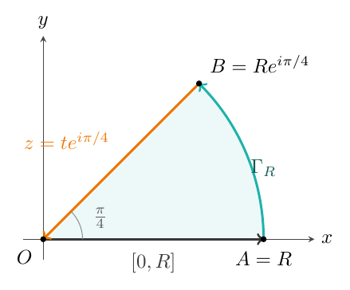

[← 上一章](../viewer.html?md=Complex-Analysis-Notes-Chapter-5)

## 留数及其应用

### 留数

#### 留数定义及其求法

> **定义**
>
> 设 $f(z)$ 以 $z=a$ 为孤立奇点, 记 $\Gamma_{\rho}:|z-a|=\rho$ ($\rho$ 很小), 称积分
> $$
> \frac{1}{2\pi i}\oint_{\Gamma_{\rho}}f(z)\,dz
> $$
> 为 $f(z)$ 在孤立奇点 $z=a$ 的留数, 记作 $\operatorname{Res}_{z=a}f(z)$.

> **注**
>
> 若 $z=a$ 是 $f(z)$ 的解析点或可去奇点, 则 $\operatorname{Res}_{z=a}f(z)=0$.

> **定理**
>
> 设 $f(z)$ 在孤立奇点 $a$ 处的 Laurent 展式为 $f(z)=\sum_{n=-\infty}^{+\infty}c_{n}(z-a)^{n}$,
> 则 $\operatorname{Res}_{z=a}f(z)=c_{-1}$.

> **证明**
>
> 记 $\Gamma_{\rho}:|z-a|=\rho$ ($\rho$ 很小), $f(z)=\sum_{n=-\infty}^{+\infty}c_{n}(z-a)^{n}$, 两边积分:
> $$
> \oint_{\Gamma_{\rho}}f(z)\,dz=\sum_{n=-\infty}^{+\infty}c_{n}\oint_{\Gamma_{\rho}}(z-a)^{n}\,dz=c_{-1}\cdot2\pi i.
> $$
> 根据留数定义, $\operatorname{Res}_{z=a}f(z)=\frac{1}{2\pi i}\oint_{\Gamma_{\rho}}f(z)\,dz=c_{-1}$.

例如:
$$
\operatorname*{Res}_{z=0}e^{\frac{1}{z}}=1,\quad
\operatorname*{Res}_{z=0}e^{\frac{1}{z^{2}}}=0,\quad
\operatorname*{Res}_{z=0}\frac{\sin z}{z^{2}}=1,\quad
\operatorname*{Res}_{z=0}\cos\frac{1}{z}=0,\quad
\operatorname*{Res}_{z=0}\frac{e^{z}}{z^{n}}=\frac{1}{(n-1)!}\quad(n\in\mathbb N^+).
$$

> **例**
>
> 计算 $\operatorname{Res}_{z=0}\frac{z\sin z}{(e^{z}-1)^{3}}$.
>
> 将分子分母展开:
> $$
> \frac{z\sin z}{(e^{z}-1)^{3}}=\frac{z(z-\frac{z^{3}}{3!}+\cdots)}{(z+\frac{z^{2}}{2!}+\cdots)^{3}}
> =\frac{1}{z}\cdot\frac{1-\frac{z^{2}}{3!}+\cdots}{(1+\frac{z}{2!}+\cdots)^{3}}
> =\frac{1}{z}(1+c_{1}z+\cdots),
> $$
> 故 $c_{-1}=1$, $\operatorname{Res}_{z=0}\frac{z\sin z}{(e^{z}-1)^{3}}=1$.

> **定理**
>
> 设 $f(z)=\frac{\varphi(z)}{(z-a)^{m}}$ 以 $z=a$ 为 $m$ 级极点, 这里 $\varphi(z)$ 在 $z=a$ 解析且 $\varphi(a)\neq0$, 则
> $$
> \operatorname{Res}_{z=a}f(z)=\frac{\varphi^{(m-1)}(a)}{(m-1)!}
> =\frac{1}{(m-1)!}\bigl[(z-a)^{m}f(z)\bigr]^{(m-1)}\Big|_{z=a}.
> $$

> **证明**
>
> $$
> \operatorname{Res}_{z=a}f(z)=\frac{1}{2\pi i}\oint_{|z-a|=\rho}f(z)\,dz
> =\frac{1}{2\pi i}\oint_{|z-a|=\rho}\frac{\varphi(z)}{(z-a)^{m}}\,dz
> =\frac{\varphi^{(m-1)}(a)}{(m-1)!}
> =\frac{1}{(m-1)!}\bigl[(z-a)^{m}f(z)\bigr]^{(m-1)}\Big|_{z=a}.
> $$

> **例**
>
> 计算下列留数:
>
> 1. $\operatorname{Res}_{z=1}\frac{e^{z}}{(z-1)^{3}}=\frac{1}{2!}(e^{z})''\big|_{z=1}=\frac{e}{2}$.
> 1. $\operatorname{Res}_{z=1}\frac{\sin z}{(z-1)^{5}}
>   =\frac{1}{4!}(\sin z)^{(4)}\big|_{z=1}=\frac{\sin1}{24}$.
>

> **推论**
>
> 若 $f(z)$ 以 $z=a$ 为一级极点, 则 $\operatorname{Res}_{z=a}f(z)=\lim_{z\to a}(z-a)f(z)$.

例如, $\operatorname{Res}_{z=0}\frac{z\sin z}{(e^{z}-1)^{3}}=\lim_{z\to0}\frac{z^{2}\sin z}{(e^{z}-1)^{3}}=\lim_{z\to0}\frac{z^{3}}{z^{3}}=1$.

> **定理**
>
> 设 $f(z)=\frac{\varphi(z)}{\psi(z)}$, 其中 $\varphi(z),\psi(z)$ 都在 $z=a$ 解析, 且 $\varphi(a)\neq0$, $\psi(a)=0$, $\psi'(a)\neq0$, 则
> $$
> \operatorname{Res}_{z=a}\frac{\varphi(z)}{\psi(z)}=\frac{\varphi(a)}{\psi'(a)}.
> $$

> **证明**
>
> $f(z)=\frac{\varphi(z)}{\psi(z)}$ 以 $z=a$ 为一级极点. 由上一定理,
> $$
> \operatorname{Res}_{z=a}\frac{\varphi(z)}{\psi(z)}=\lim_{z\to a}(z-a)\frac{\varphi(z)}{\psi(z)}
> =\lim_{z\to a}\frac{\varphi(z)}{\frac{\psi(z)}{z-a}}=\frac{\varphi(a)}{\psi'(a)}.
> $$

> **例**
>
> 计算下列留数:
>
> 1. $\operatorname{Res}_{z=i}\frac{1}{z^{2}+1}=\frac{1}{(z^{2}+1)'}\big|_{z=i}=\frac{1}{2i}$.
> 1. $\operatorname{Res}_{z=-1}\frac{1}{z^{5}+1}=\frac{1}{(z^{5}+1)'}\big|_{z=-1}=\frac{1}{5}$.
> 1. $\operatorname{Res}_{z=i}\frac{1}{z^{6}+1}=\frac{1}{(z^{6}+1)'}\big|_{z=i}=\frac{1}{6i}$.
> 1. $\operatorname{Res}_{z=-1}\frac{\sin z}{z^{3}+1}
>   =\frac{\sin(-1)}{3(-1)^{2}}=-\frac{\sin1}{3}$.
>

> **例**
>
> 对 $n\in\mathbb N^{+}$, $z=i$ 是 $1/(z^{2}+1)^{n}$ 的 $n$ 级极点, 因此
> $$
> \begin{aligned}
> \operatorname*{Res}_{z=i}\frac{1}{(z^{2}+1)^{n}}
> &=\frac{1}{(n-1)!}
> \left[\frac{d^{n-1}}{dz^{n-1}}\frac{1}{(z+i)^{n}}\right]_{z=i}\\
> &=\frac{(-1)^{n-1}(2n-2)!}{\bigl((n-1)!\bigr)^{2}(2i)^{2n-1}}.
> \end{aligned}
> $$

#### 留数定理

> **定理**
>
> [留数定理]
> 设 $f(z)$ 在围线 $C$ 所围区域内除了 $n$ 个孤立奇点 $a_{1},\cdots,a_{n}$ 外解析, 且 $f(z)$ 在 $C$ 上连续, 则
> $$
> \oint_{C}f(z)\,dz=2\pi i\sum_{k=1}^{n}\operatorname{Res}_{z=a_{k}}f(z).
> $$

> **证明**
>
> 以 $a_{k}$ 为圆心作小圆 $\Gamma_{\rho_{k}}:|z-a_{k}|=\rho_{k}$, $\rho_{k}$ 很小使 $\Gamma_{\rho_{k}}$ 含在 $C$ 内且互不相交、互不包含. $C$ 与 $n$ 个 $\Gamma_{\rho_{k}}$ 组合成复曲线 $C+\Gamma_{\rho_{1}}^{-1}+\cdots+\Gamma_{\rho_{n}}^{-1}$, 由复曲线上的 Cauchy 积分定理,
> $$
> \oint_{C+\Gamma_{\rho_{1}}^{-1}+\cdots+\Gamma_{\rho_{n}}^{-1}}f(z)\,dz=0,
> $$
> 即 $\oint_{C}f(z)\,dz=\sum_{k=1}^{n}\oint_{\Gamma_{\rho_{k}}}f(z)\,dz=2\pi i\sum_{k=1}^{n}\operatorname{Res}_{z=a_{k}}f(z)$.

> **注**
>
> 留数定理中的曲线 $C$ 可以推广为复曲线.

> **例**
>
> (1) $\displaystyle\oint_{|z|=2}\frac{5z-1}{z(z-1)^{2}}\,dz=2\pi i\Bigl(\operatorname*{Res}_{z=0}\frac{5z-1}{z(z-1)^{2}}+\operatorname*{Res}_{z=1}\frac{5z-1}{z(z-1)^{2}}\Bigr)=2\pi i(-1+1)=0$.
>
> (2) 对 $n\in\mathbb N^{+}$，$\displaystyle\oint_{|z|=n}\tan\pi z\,dz$: $\tan\pi z=\frac{\sin\pi z}{\cos\pi z}$ 的极点为 $z=k+\frac{1}{2}$, 在每个极点处 $\operatorname{Res}\tan\pi z=-\frac{1}{\pi}$, 故 $\oint_{|z|=n}\tan\pi z\,dz=2\pi i\cdot(-\frac{1}{\pi})\cdot2n=-4ni$.

#### 无穷远点的留数

> **定义**
>
> 设 $f(z)$ 在 $r<|z|<+\infty$ 内解析, 则 $f(z)$ 在 $\infty$ 的留数定义为
> $$
> \operatorname{Res}_{z=\infty}f(z)=\frac{1}{2\pi i}\oint_{C^{-}}f(z)\,dz,
> $$
> 其中 $C:|z|=\rho>r$, $C^{-}$ 为顺时针方向.

> **定理**
>
> 设 $f(z)$ 在孤立奇点 $\infty$ 的 Laurent 级数为 $f(z)=\sum_{n=-\infty}^{+\infty}c_{n}z^{n}$ ($|z|>r$), 则
> $$
> \operatorname{Res}_{z=\infty}f(z)=-c_{-1}.
> $$

> **证明**
>
> 记 $\Gamma_{\rho}:|z|=\rho$ ($\rho$ 很大). 由于
> $$
> \oint_{\Gamma_{\rho}}z^{n}\,dz=
> \begin{cases}
> 2\pi i, & n=-1,\\
> 0, & n\neq -1,
> \end{cases}
> $$
> $f(z)=\sum_{n=-\infty}^{+\infty}c_{n}z^{n}$ 两边积分得
> $$
> \oint_{\Gamma_{\rho}}f(z)\,dz=\sum_{n=-\infty}^{+\infty}c_{n}\oint_{\Gamma_{\rho}}z^{n}\,dz=2\pi i\cdot c_{-1}.
> $$
> 于是 $\frac{1}{2\pi i}\oint_{\Gamma_{\rho}}f(z)\,dz=c_{-1}$, 故
> $$
> \operatorname{Res}_{z=\infty}f(z)=\frac{1}{2\pi i}\oint_{\Gamma_{\rho}^{-}}f(z)\,dz=-c_{-1}.
> $$

> **定理**
>
> 若 $f(z)$ 在扩充复平面上只有有限个孤立奇点: $a_{1},\cdots,a_{n}$ 和 $\infty$, 则
> $$
> \sum_{k=1}^{n}\operatorname{Res}_{z=a_{k}}f(z)+\operatorname{Res}_{z=\infty}f(z)=0.
> $$

> **证明**
>
> 取充分大的正向圆周 $\Gamma_{\rho}:|z|=\rho$, 使所有有限奇点都在其内部. 由留数定理,
> $$
> \oint_{\Gamma_{\rho}}f(z)\,dz=2\pi i\sum_{k=1}^{n}\operatorname{Res}_{z=a_{k}}f(z).
> $$
> 而 $\operatorname{Res}_{z=\infty}f(z)=\frac{1}{2\pi i}\oint_{\Gamma_{\rho}^{-}}f(z)\,dz
> =-\frac{1}{2\pi i}\oint_{\Gamma_{\rho}}f(z)\,dz$, 故结论成立.

> **例**
>
> $$
> \operatorname*{Res}_{z=0}e^{\frac{1}{z}}=c_{-1}=1,\quad
> \operatorname*{Res}_{z=\infty}e^{\frac{1}{z}}=-c_{-1}=-1,\\
> \operatorname*{Res}_{z=\infty}\sin z=0,\quad
> \operatorname*{Res}_{z=\infty}\sin\frac{1}{z}=-1,\quad
> \operatorname*{Res}_{z=\infty}\sin\frac{1}{z^{3}}=0.
> $$

> **例**
>
> 计算无穷远点留数:
> $$
> \operatorname*{Res}_{z=\infty}
> \frac{z^{2}+1}{z(z-1)(z-2)(z-3)}.
> $$
> 由扩充复平面上全部留数之和为零,
> $$
> \operatorname*{Res}_{z=\infty}f
> =-\sum_{a=0,1,2,3}\operatorname*{Res}_{z=a}f
> =-\left(-\frac16+1-\frac52+\frac53\right)=0.
> $$

### 留数的应用

#### 计算 $\int_{0}^{2\pi}R(\cos\theta,\sin\theta)\,d\theta$

作变换 $z=e^{i\theta}$, $d\theta=\frac{dz}{iz}$, 则:
$$
\cos\theta=\frac{z+z^{-1}}{2},\quad
\sin\theta=\frac{z-z^{-1}}{2i},
$$
$$
\int_{0}^{2\pi}R(\cos\theta,\sin\theta)\,d\theta
=\oint_{|z|=1}R\Bigl(\frac{z+z^{-1}}{2},\frac{z-z^{-1}}{2i}\Bigr)\frac{dz}{iz}
=2\pi i\sum_{|a_{k}|<1}\operatorname{Res}_{z=a_{k}}f(z).
$$
这里 $R(u,v)$ 是二元有理分式函数.

> **例**
>
> 计算 $I=\int_{0}^{2\pi}\frac{1}{1-2p\cos\theta+p^{2}}\,d\theta$
> （$p\in\mathbb R$, $|p|<1$）.
>
> 设 $z=e^{i\theta}$, 则 $\cos\theta=\frac{z+z^{-1}}{2}$,
> $$
> I=\oint_{|z|=1}\frac{1}{1-2p\cdot\frac{z+z^{-1}}{2}+p^{2}}\cdot\frac{dz}{iz}
> =\frac{1}{i}\oint_{|z|=1}\frac{dz}{-pz^{2}+(1+p^{2})z-p}
> =i\oint_{|z|=1}\frac{dz}{(pz-1)(z-p)}
> =2\pi\cdot\frac{1}{1-p^{2}}=\frac{2\pi}{1-p^{2}}.
> $$

> **例**
>
> 计算 $I=\int_{0}^{\pi}\frac{\cos mx}{5-4\cos x}\,dx$
> （$m\in\mathbb N_{0}$）.
>
> $I=\frac{1}{2}\int_{-\pi}^{\pi}\frac{\cos mx}{5-4\cos x}\,dx$, 记 $I_{1}=\frac{1}{2}\int_{-\pi}^{\pi}\frac{\sin mx}{5-4\cos x}\,dx=0$,
> $$
> I+iI_{1}=\frac{1}{2}\int_{-\pi}^{\pi}\frac{e^{imx}}{5-4\cos x}\,dx
> =\frac{1}{2}\oint_{|z|=1}\frac{z^{m}}{5-4\cdot\frac{z+z^{-1}}{2}}\cdot\frac{dz}{iz}
> =\frac{i}{2}\oint_{|z|=1}\frac{z^{m}}{(2z-1)(z-2)}\,dz.
> $$
> 在 $|z|<1$ 内仅有极点 $z=\frac{1}{2}$,
> $$
> I=\frac{i}{4}\oint_{|z|=1}\frac{z^{m}}{(z-\frac{1}{2})(z-2)}\,dz
> =\frac{i}{4}\cdot2\pi i\cdot\frac{(\frac{1}{2})^{m}}{\frac{1}{2}-2}
> =\frac{\pi}{3}\cdot\frac{1}{2^{m}}.
> $$

#### 计算 $\int_{-\infty}^{+\infty}\frac{P_{n}(x)}{Q_{m}(x)}\,dx$

> **引理**
>
> [Jordan 弧引理]
> 设 $f(z)$ 在扇形区域 $D:\{|z|>r,\ \theta_{1}\leq\arg z\leq\theta_{2}\}$ 上连续, 且满足 $\lim_{z\to\infty}zf(z)=\lambda$. 记 $\Gamma_{\rho}:z=\rho e^{i\theta}$, $\theta_{1}\leq\theta\leq\theta_{2}$, 则
> $$
> \lim_{\rho\to+\infty}\int_{\Gamma_{\rho}}f(z)\,dz=i(\theta_{2}-\theta_{1})\lambda.
> $$

> **证明**
>
> $\lim_{z\to\infty}zf(z)=\lambda\Leftrightarrow\lim_{\rho\to+\infty}\rho e^{i\theta}f(\rho e^{i\theta})=\lambda$ 关于 $\theta\in[\theta_{1},\theta_{2}]$ 一致收敛.
> $$
> \lim_{\rho\to+\infty}\int_{\Gamma_{\rho}}f(z)\,dz
> \xlongequal{z=\rho e^{i\theta}}\lim_{\rho\to+\infty}i\int_{\theta_{1}}^{\theta_{2}}f(\rho e^{i\theta})\rho e^{i\theta}\,d\theta
> =i\int_{\theta_{1}}^{\theta_{2}}\lambda\,d\theta
> =i(\theta_{2}-\theta_{1})\lambda.
> $$

> **定理**
>
> 设 $P_{n}(x),Q_{m}(x)$ 是两个实系数互质多项式, $Q_{m}(x)\neq0$ 对 $\forall x\in\mathbb{R}$, 且 $m-n\geq2$, 则
> $$
> \int_{-\infty}^{+\infty}\frac{P_{n}(x)}{Q_{m}(x)}\,dx
> =2\pi i\sum_{\operatorname{Im}a_{k}>0}\operatorname{Res}_{z=a_{k}}\frac{P_{n}(z)}{Q_{m}(z)},
> $$
> 其中 $a_{k}$ 是 $Q_{m}(z)=0$ 的根, 也是 $\frac{P_{n}(z)}{Q_{m}(z)}$ 在上半平面的孤立奇点.

> **证明**
>
> 记实轴上从 $x=-R$ 到 $x=R$ 的有向线段为 $[-R,R]$.
> $\int_{-\infty}^{+\infty}\frac{P_{n}(x)}{Q_{m}(x)}\,dx=\lim_{R\to+\infty}\int_{-R}^{R}\frac{P_{n}(x)}{Q_{m}(x)}\,dx$.
> 记 $\Gamma_{R}:z=Re^{i\theta}$, $0\leq\theta\leq\pi$, 则
> $$
> \int_{\Gamma_{R}}\frac{P_{n}(z)}{Q_{m}(z)}\,dz+\int_{[-R,R]}\frac{P_{n}(z)}{Q_{m}(z)}\,dz
> =\oint_{\Gamma_{R}+[-R,R]}\frac{P_{n}(z)}{Q_{m}(z)}\,dz
> =2\pi i\sum_{\operatorname{Im}a_{k}>0}\operatorname{Res}_{z=a_{k}}\frac{P_{n}(z)}{Q_{m}(z)}.
> $$
> 由 Lemma 1, $\lim_{R\to+\infty}z\cdot\frac{P_{n}(z)}{Q_{m}(z)}=0$ (因 $m-n\geq2$), 故 $\lim_{R\to+\infty}\int_{\Gamma_{R}}\frac{P_{n}(z)}{Q_{m}(z)}\,dz=0$. 令 $R\to+\infty$ 即得.

> **例**
>
> 计算 $\int_{0}^{+\infty}\frac{1}{x^{4}+1}\,dx$.
>
>
> 解: $z^{4}+1=0$ 的根: $a_{k}=e^{\frac{\pi+2k\pi}{4}i}$, $k=0,1,2,3$. 在上半平面的为 $a_{0}=e^{\frac{\pi}{4}i}$, $a_{1}=e^{\frac{3\pi}{4}i}$.
> $$
> \int_{0}^{+\infty}\frac{1}{x^{4}+1}\,dx
> =\frac{1}{2}\int_{-\infty}^{+\infty}\frac{1}{x^{4}+1}\,dx
> =\frac{1}{2}\cdot2\pi i\Bigl(\operatorname{Res}_{z=a_{0}}\frac{1}{z^{4}+1}+\operatorname{Res}_{z=a_{1}}\frac{1}{z^{4}+1}\Bigr)
> =\pi i\Bigl(\frac{1}{4z^{3}}\Big|_{z=a_{0}}+\frac{1}{4z^{3}}\Big|_{z=a_{1}}\Bigr)
> =\pi i\cdot\Bigl(-\frac{a_{0}+a_{1}}{4}\Bigr)
> =\frac{\pi\sqrt{2}}{4}=\frac{\pi}{2\sqrt{2}}.
> $$

> **例**
>
> 计算 $I=\int_{0}^{+\infty}\frac{1}{(1+x^{2})^{2}}\,dx$.
>
> $I=\frac{1}{2}\int_{-\infty}^{+\infty}\frac{1}{(1+x^{2})^{2}}\,dx
> =\frac{1}{2}\cdot2\pi i\operatorname*{Res}_{z=i}\frac{1}{(1+z^{2})^{2}}
> =\pi i\cdot\frac{1}{1!}\Bigl(\frac{1}{(z+i)^{2}}\Bigr)'\Big|_{z=i}=\frac{\pi}{4}$.

#### 计算 $\int_{-\infty}^{+\infty}\frac{P_{n}(x)}{Q_{m}(x)}e^{imx}\,dx$

> **引理**
>
> [Jordan 引理]
> 设 $f(z)$ 在扇形区域 $D:\{|z|>r,\ 0\leq\arg z\leq\pi\}$ 上连续且 $\lim_{z\to\infty}f(z)=0$, 则当 $m>0$ 时, 记 $\Gamma_{\rho}:z=\rho e^{i\theta}$, $0\leq\theta\leq\pi$,
> $$
> \lim_{\rho\to+\infty}\int_{\Gamma_{\rho}}f(z)e^{imz}\,dz=0.
> $$

> **证明**
>
> $\forall\varepsilon>0$, 由 $\lim_{z\to\infty}f(z)=0$, $\exists R>0$ s.t. 当 $|z|>R$ 时 $|f(z)|<\varepsilon$. 当 $\rho>R$ 时,
> $$
> \Bigl|\int_{\Gamma_{\rho}}f(z)e^{imz}\,dz\Bigr|
> \leq\rho\varepsilon\int_{0}^{\pi}|e^{im\rho(\cos\theta+i\sin\theta)}|\,d\theta
> =\rho\varepsilon\int_{0}^{\pi}e^{-m\rho\sin\theta}\,d\theta
> =2\rho\varepsilon\int_{0}^{\frac{\pi}{2}}e^{-m\rho\sin\theta}\,d\theta.
> $$
> 在 $[0,\frac{\pi}{2}]$ 上 $\sin\theta\geq\frac{2}{\pi}\theta$, 故
> $$
> \int_{0}^{\frac{\pi}{2}}e^{-m\rho\sin\theta}\,d\theta
> \leq\int_{0}^{\frac{\pi}{2}}e^{-m\rho\cdot\frac{2}{\pi}\theta}\,d\theta
> =\frac{\pi}{2m\rho}(1-e^{-m\rho})<\frac{\pi}{2m\rho}.
> $$
> 因此 $\bigl|\int_{\Gamma_{\rho}}f(z)e^{imz}\,dz\bigr|<2\rho\varepsilon\cdot\frac{\pi}{2m\rho}=\frac{\pi\varepsilon}{m}$, 令 $\varepsilon\to0$ 即得.

> **定理**
>
> 设 $P_{n}(x),Q_{q}(x)$ 是两个实系数互质多项式, 且对任意 $x\in\mathbb{R}$ 有 $Q_{q}(x)\neq0$, 则当 $q>n$ 且 $m>0$ 时,
> $$
> \int_{-\infty}^{+\infty}\frac{P_{n}(x)}{Q_{q}(x)}e^{imx}\,dx
> =2\pi i\sum_{\operatorname{Im}a_{k}>0}\operatorname{Res}_{z=a_{k}}\frac{P_{n}(z)}{Q_{q}(z)}e^{imz},
> $$
> 这里 $a_{k}$ 是 $\frac{P_{n}(z)}{Q_{q}(z)}e^{imz}$ 的孤立奇点.

> **证明**
>
> 记实轴上从 $x=-R$ 到 $x=R$ 的有向线段为 $[-R,R]$, 记 $\Gamma_{\rho}:z=\rho e^{i\theta}$ ($0\leq\theta\leq\pi$), 则
> $$
> \int_{\Gamma_{\rho}}\frac{P_{n}(z)}{Q_{q}(z)}e^{imz}\,dz
> +\int_{[-R,R]}\frac{P_{n}(x)}{Q_{q}(x)}e^{imx}\,dx
> =\oint\frac{P_{n}(z)}{Q_{q}(z)}e^{imz}\,dz.
> $$
> 当 $\rho$ 很大时, 右端等于 $2\pi i\sum_{\operatorname{Im}a_{k}>0}\operatorname{Res}_{z=a_{k}}\frac{P_{n}(z)}{Q_{q}(z)}e^{imz}$.
> 令 $\rho\to+\infty$, 由 Jordan 引理 $\int_{\Gamma_{\rho}}\to0$, 且 $\int_{[-R,R]}\to\int_{-\infty}^{+\infty}$.

> **注**
>
> 定理中 $e^{imx}=\cos mx+i\sin mx$, 内含两个广义积分
> $\displaystyle\int_{-\infty}^{+\infty}\frac{P_{n}(x)}{Q_{q}(x)}\cos mx\,dx$ 与
> $\displaystyle\int_{-\infty}^{+\infty}\frac{P_{n}(x)}{Q_{q}(x)}\sin mx\,dx$.

> **例**
>
> 计算 $I=\int_{0}^{+\infty}\frac{x\sin x}{x^{2}+1}\,dx$.
>
> 记 $I_{1}=\int_{-\infty}^{+\infty}\frac{x\cos x}{x^{2}+1}\,dx=0$ (奇函数),
> $$
> I_{1}+2iI=\int_{-\infty}^{+\infty}\frac{x}{x^{2}+1}e^{ix}\,dx
> =2\pi i\operatorname*{Res}_{z=i}\frac{z}{z^{2}+1}e^{iz}
> =2\pi i\cdot\frac{ie^{-1}}{2i}=\frac{\pi i}{e}.
> $$
> 比较虚部, 故 $I=\frac{\pi}{2e}$.

> **例**
>
> 计算 $I=\int_{-\infty}^{+\infty}\frac{\cos mx}{x^{2}+1}\,dx=\pi e^{-m}$ ($m>0$).

#### 计算 Fresnel 积分

考察 $f(z)=e^{-z^{2}}$ 在围线 $C$ 上积分, 这里 $C=\overrightarrow{OA}+\Gamma_{R}+\overrightarrow{BO}$. 由 Cauchy 积分定理可得
$$
\int_{0}^{+\infty}\cos x^{2}\,dx=\int_{0}^{+\infty}\sin x^{2}\,dx=\frac{1}{2}\sqrt{\frac{\pi}{2}}.
$$

> **证明**
>
> 取围线 $C=\overrightarrow{OA}+\Gamma_{R}+\overrightarrow{BO}$. 由于 $e^{-z^{2}}$ 是整函数,
> 
> 由 Cauchy 积分定理,
> $$
> \oint_{C}e^{-z^{2}}\,dz=\int_{\overrightarrow{OA}}e^{-z^{2}}\,dz+\int_{\Gamma_{R}}e^{-z^{2}}\,dz+\int_{\overrightarrow{BO}}e^{-z^{2}}\,dz=0,
> $$
> 其中 $\int_{\overrightarrow{OA}}e^{-z^{2}}\,dz=\int_{0}^{R}e^{-x^{2}}\,dx$.
> 在圆弧 $\Gamma_{R}:z=Re^{i\theta}$ ($0\leq\theta\leq\frac{\pi}{4}$) 上,
> $$
> \begin{aligned}
> \left|\int_{\Gamma_R}e^{-z^{2}}\,dz\right|
> &\leq R\int_{0}^{\pi/4}e^{-R^{2}\cos2\theta}\,d\theta\\
> &=\frac{R}{2}\int_{0}^{\pi/2}e^{-R^{2}\sin\varphi}\,d\varphi
> \leq\frac{R}{2}\int_{0}^{\pi/2}e^{-2R^{2}\varphi/\pi}\,d\varphi\\
> &=\frac{\pi}{4R}(1-e^{-R^{2}})<\frac{\pi}{4R}\longrightarrow0,
> \end{aligned}
> $$
> 其中用到 $0\leq\varphi\leq\pi/2$ 时 $\sin\varphi\geq2\varphi/\pi$.
> 对 $\overrightarrow{BO}$: $z=xe^{i\pi/4}$, $x$ 从 $R$ 到 $0$,
> $$
> \int_{\overrightarrow{BO}}e^{-z^{2}}\,dz
> =\int_{R}^{0}e^{i\pi/4}e^{-ix^{2}}\,dx
> =-e^{i\pi/4}\Bigl[\int_{0}^{R}\cos x^{2}\,dx-i\int_{0}^{R}\sin x^{2}\,dx\Bigr].
> $$
> 令 $R\to+\infty$, 并用 $\int_{0}^{+\infty}e^{-x^{2}}\,dx=\frac{\sqrt{\pi}}{2}$, 得
> $$
> \int_{0}^{+\infty}e^{-x^{2}}\,dx-e^{i\pi/4}\Bigl[\int_{0}^{+\infty}\cos x^{2}\,dx-i\int_{0}^{+\infty}\sin x^{2}\,dx\Bigr]=0,
> $$
> 即
> $$
> \int_{0}^{+\infty}\cos x^{2}\,dx-i\int_{0}^{+\infty}\sin x^{2}\,dx
> =e^{-i\pi/4}\frac{\sqrt{\pi}}{2}
> =\frac{\sqrt{\pi}}{2\sqrt{2}}(1-i).
> $$
> 比较实部与虚部即得
> $$
> \int_{0}^{+\infty}\cos x^{2}\,dx=\int_{0}^{+\infty}\sin x^{2}\,dx=\frac{1}{2}\sqrt{\frac{\pi}{2}}.
> $$

> **注**
>
> 还可用留数定理计算 $\int_{0}^{+\infty}\frac{\sin x}{x}\,dx=\frac{\pi}{2}$.

### 辐角原理与儒歇定理

问题: $\oint_{C}\frac{f'(z)}{f(z)}\,dz$ 的几何意义; $\operatorname{Res}\frac{f'(z)}{f(z)}$ 与 $C$ 内 $f(z)$ 极点、零点的关系.

#### 对数留数

> **定义**
>
> 设 $f(z)$ 在围线 $C$ 的某个邻域内解析，且在 $C$ 上非零, 称积分
> $$
> \frac{1}{2\pi i}\oint_{C}\frac{f'(z)}{f(z)}\,dz
> $$
> 为 $f(z)$ 在 $C$ 上的对数留数.

> **定理**
>
> 设 $f(z)$ 在围线 $C$ 上解析非零, 则
> $$
> \frac{1}{2\pi i}\oint_{C}\frac{f'(z)}{f(z)}\,dz=\frac{\Delta_{C}\arg f(z)}{2\pi},
> $$
> 这里 $\frac{\Delta_{C}\arg f(z)}{2\pi}$ 表示当 $z$ 绕 $C$ 一周时其像曲线绕原点的环绕圈数.

> **证明**
>
> $$
> \frac{1}{2\pi i}\oint_{C}\frac{f'(z)}{f(z)}\,dz
> =\frac{1}{2\pi i}\oint_{C}d\ln f(z)
> =\frac{1}{2\pi i}\oint_{C}d\bigl(\ln|f(z)|+i\arg f(z)\bigr)
> =\frac{1}{2\pi i}\oint_{C}d\ln|f(z)|+\frac{1}{2\pi}\oint_{C}d\arg f(z)
> =0+\frac{\Delta_{C}\arg f(z)}{2\pi}.
> $$

> **引理**
>
> 若 $f(z)$ 以 $z=a$ 为 $n$ 级零点, 则 $\frac{f'(z)}{f(z)}$ 以 $z=a$ 为一级极点, 且 $\operatorname{Res}_{z=a}\frac{f'(z)}{f(z)}=n$.

> **证明**
>
> $f(z)=(z-a)^{n}\varphi(z)$, $\varphi(a)\neq0$. 则
> $$
> \frac{f'(z)}{f(z)}=\frac{n(z-a)^{n-1}\varphi(z)+(z-a)^{n}\varphi'(z)}{(z-a)^{n}\varphi(z)}
> =\frac{n}{z-a}+\frac{\varphi'(z)}{\varphi(z)}.
> $$
> $\frac{\varphi'(z)}{\varphi(z)}$ 在 $z=a$ 解析, 故 $\frac{f'(z)}{f(z)}$ 以 $z=a$ 为一级极点, 留数为 $n$.

> **引理**
>
> 若 $f(z)$ 以 $z=a$ 为 $m$ 级极点, 则 $\frac{f'(z)}{f(z)}$ 以 $z=a$ 为一级极点, 且 $\operatorname{Res}_{z=a}\frac{f'(z)}{f(z)}=-m$.

> **证明**
>
> $f(z)=\frac{\psi(z)}{(z-a)^{m}}$, $\psi(a)\neq0$. 则
> $$
> \frac{f'(z)}{f(z)}=\frac{\psi'(z)(z-a)^{m}-m(z-a)^{m-1}\psi(z)}{(z-a)^{2m}}\cdot\frac{(z-a)^{m}}{\psi(z)}
> =\frac{-m}{z-a}+\frac{\psi'(z)}{\psi(z)}.
> $$
> $\frac{\psi'(z)}{\psi(z)}$ 在 $z=a$ 解析, 故 $\frac{f'(z)}{f(z)}$ 以 $z=a$ 为一级极点, 留数为 $-m$.

#### 辐角原理

> **定理**
>
> [辐角原理]
> 设 $f(z)$ 在围线 $C$ 内除有限个极点外解析, 在 $C$ 上也解析且非零, 则
> $$
> \frac{\Delta_{C}\arg f(z)}{2\pi}=N(f,C)-P(f,C)=N-P.
> $$
> 这里 $N$ 表示 $f(z)$ 在 $C$ 内零点总个数 ($n$ 级零点表示 $n$ 个零点),
> $P$ 表示 $f(z)$ 在 $C$ 内极点总个数 ($m$ 级极点表示 $m$ 个极点).

> **证明**
>
> $\frac{\Delta_{C}\arg f(z)}{2\pi}=\frac{1}{2\pi i}\oint_{C}\frac{f'(z)}{f(z)}\,dz$.
> 记 $f(z)$ 在 $C$ 内零点 $a_{1},\cdots,a_{p}$ 与极点 $b_{1},\cdots,b_{q}$, 对应级为 $n_{1},\cdots,n_{p}$ 与 $m_{1},\cdots,m_{q}$.
> 则 $\frac{f'(z)}{f(z)}$ 在 $C$ 内以 $a_{1},\cdots,a_{p},b_{1},\cdots,b_{q}$ 为一级极点.
> 由留数定理,
> $$
> \frac{1}{2\pi i}\oint_{C}\frac{f'(z)}{f(z)}\,dz
> =\sum_{i=1}^{p}\operatorname{Res}_{z=a_{i}}\frac{f'(z)}{f(z)}
> +\sum_{i=1}^{q}\operatorname{Res}_{z=b_{i}}\frac{f'(z)}{f(z)}.
> $$
> 由上述两引理,
> $$
> \sum_{i=1}^{p}\operatorname{Res}_{z=a_{i}}\frac{f'(z)}{f(z)}
> +\sum_{i=1}^{q}\operatorname{Res}_{z=b_{i}}\frac{f'(z)}{f(z)}
> =\sum_{i=1}^{p}n_{i}-\sum_{i=1}^{q}m_{i}=N-P.
> $$

> **例**
>
> $f(z)=(z-1)(z-2)^{3}(z-4)$ 在 $|z|<3$ 上解析, 有 4 个零点, 则 $N-P=4$.
> 沿 $|z|=3$ 逆时针转一圈时 $f(z)$ 绕原点转四圈.

#### 儒歇定理

> **定理**
>
> [Rouch\'{e} 定理]
> 设 $f(z)$ 与 $\varphi(z)$ 在 $C$ 内解析, 在 $C$ 上解析且 $|f(z)|>|\varphi(z)|$,
> 则 $f(z)$ 与 $f(z)\pm\varphi(z)$ 在 $C$ 内部有同样个数的零点.

> **证明**
>
> 在 $C$ 上 $|f(z)|>0$, $\bigl|\frac{\varphi(z)}{f(z)}\bigr|<1$,
> $$
> \Delta_{C}\arg\bigl[f(z)\pm\varphi(z)\bigr]
> =\Delta_{C}\arg\Bigl[f(z)\Bigl(1\pm\frac{\varphi(z)}{f(z)}\Bigr)\Bigr]
> =\Delta_{C}\arg f(z)+\Delta_{C}\arg\Bigl(1\pm\frac{\varphi(z)}{f(z)}\Bigr)
> =\Delta_{C}\arg f(z)+0.
> $$
> 由辐角原理, $N_{1}-P_{1}=N_{2}-P_{2}$ ($P_{1}=P_{2}=0$),
> 于是 $N_{1}=N_{2}$, 其中 $N_{1},N_{2}$ 分别表示 $f(z)$ 和 $f(z)\pm\varphi(z)$ 在 $C$ 内的零点个数.

> **例**
>
> (1) 方程 $z^{5}+8z^{3}+2z+1=0$ 在 $|z|<1$ 内有 3 个零点:
> 取 $f(z)=8z^{3}$, $\varphi(z)=z^{5}+2z+1$, 在 $|z|=1$ 上 $|\varphi(z)|\leq4<8=|f(z)|$, 由 Rouch\'e 定理, $f(z)$ 在 $|z|<1$ 内有 3 个零点, 故原方程也有 3 个零点.
>
> (2) 方程 $z^{8}+7z^{2}+2z+19=0$ 在 $|z|<2$ 内有 8 个根:
> 取 $f(z)=z^{8}$, $\varphi(z)=7z^{2}+2z+19$, 在 $|z|=2$ 上 $|\varphi/f|<1$, $f(z)$ 有 8 个零点, 故原方程在 $|z|<2$ 内也有 8 个根.
> 取 $f(z)=19$, $\varphi(z)=z^{8}+7z^{2}+2z$, 在 $|z|=1$ 上 $|\varphi/f|<1$, 故 $|z|<1$ 内有 0 个根.
>
> (3) 任意 $n$ 次多项式方程 $z^{n}+a_{n-1}z^{n-1}+\cdots+a_{1}z+a_{0}=0$ 在复平面上有 $n$ 个根:
> 取 $f(z)=z^{n}$, $\varphi(z)=a_{n-1}z^{n-1}+\cdots+a_{0}$, 当 $|z|$ 充分大时 $|f(z)|>|\varphi(z)|$, 故有 $n$ 个零点.

[目录与前言](../viewer.html?md=Complex-Analysis-Notes) · [下一章 →](../viewer.html?md=Complex-Analysis-Notes-Chapter-7)
