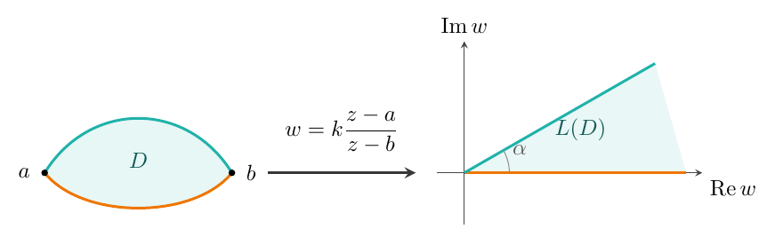

[← 上一章](../viewer.html?md=Complex-Analysis-Notes-Chapter-6)

## 保形变换

### 解析函数的几何性质

> **定理**
>
> 设 $f(z)$ 在区域 $D$ 上单叶解析, 则 $f'(z)\neq0$ ($\forall z\in D$).

> **证明**
>
> 若 $\exists z_{0}\in D$ 使 $f'(z_{0})=0$, 则 $z_{0}$ 是 $f(z)-f(z_{0})$ 的 $n$ 级零点 ($n\geq2$). 此时 $z_{0}$ 也是 $f'(z)$ 的零点. 由零点的孤立性知,
> $\exists\rho>0$ 很小, 在 $|z-z_{0}|\leq\rho$ 上 $f(z)-f(z_{0})$ 与 $f'(z)$ 都只有 $z_{0}$ 一个零点.
> 记 $\displaystyle\min_{|z-z_{0}|=\rho}|f(z)-f(z_{0})|=\delta>0$, 取 $0<|a|<\delta$.
> 由 Rouch\'{e} 定理, $f(z)-f(z_{0})$ 与 $f(z)-f(z_{0})-a$ 在 $|z-z_{0}|<\rho$ 内有同样多的零点, 记作 $a_{1},\ldots,a_{n}$. 使 $f(a_{i})=f(z_{0})+a$.
> 在 $0<|z-z_{0}|<\rho$ 内 $f'(z)\neq0$. 又因 $a\neq0$ 时 $a_i\neq z_0$, 故 $f'(a_{i})\neq0$,
> $a_{i}$ 是 $f(z)-f(z_{0})-a$ 的一级零点. 因此 $a_{1},\ldots,a_{n}$ 互不相等,
> 与 $f(z)$ 在 $D$ 上单叶矛盾.

> **注**
>
> 定理1的逆命题不成立. 反例: $f(z)=e^{z}$, $f'(z)=e^{z}\neq0$ 处处成立, 但 $f(z)$ 是周期函数, 不是单叶的.

> **定理**
>
> 设 $f(z)$ 在区域 $D$ 内解析且 $\exists z_{0}\in D$ 使 $f'(z_{0})\neq0$, 则 $f(z)$ 在 $z_{0}$ 某邻域内单叶.

> **证明**
>
> $f(z)-f(z_{0})$ 以 $z_{0}$ 为一级零点, 由零点孤立性, $\exists\rho>0$ 使在 $|z-z_{0}|\leq\rho$ 上 $f(z)-f(z_{0})$ 只有 $z_{0}$ 一个零点.
> 记 $\displaystyle\min_{|z-z_{0}|=\rho}|f(z)-f(z_{0})|=\delta>0$, $f(z_{0})=w^{*}$. 取 $m>0$ 使 $m<\delta$.
> 对 $|w-w^{*}|<m$ 的 $w$, 由 Rouch\'{e} 定理, 在 $|z-z_{0}|<\rho$ 内 $f(z)-f(z_{0})$ 与 $f(z)-f(z_{0})-w+w^{*}=f(z)-w$ 有同样多个零点,
> 前者只有一级零点 $z_0$，故后者恰有一个零点。即 $w^{*}$ 的 $m$ 邻域内
> 任一 $w$ 都在 $|z-z_{0}|<\rho$ 内有唯一原像 $z$ 使 $f(z)=w$.
> 由 $f(z)$ 在 $z_{0}$ 的连续性, $\exists z_{0}$ 的某邻域 $|z-z_{0}|<r<\rho$ 使 $f(z)$ 全落在 $w^{*}$ 的 $m$ 邻域内, 此时 $f(z)$ 在该邻域上单叶.

#### 解析函数的保域性

> **定理**
>
> [保域性定理]
> 设 $f(z)$ 在区域 $D$ 上解析且非常数, 则其像集 $G=f(D)$ 也是区域.

> **证明**
>
> (1) 先证 $G=f(D)$ 中每个点都是内点. 任取 $w^{*}\in f(D)$, 记 $f(z_{0})=w^{*}$.
> $f(z)-f(z_{0})$ 以 $z_{0}$ 为零点, 由零点孤立性, $\exists\rho>0$ 使 $f(z)-f(z_{0})$ 在 $|z-z_{0}|\leq\rho$ 上没有除 $z_{0}$ 外的其他零点.
> 记 $\displaystyle\min_{|z-z_{0}|=\rho}|f(z)-f(z_{0})|=\delta>0$, 取 $m>0$ 使 $m<\delta$. 对 $|w-w^{*}|<m$, 在 $|z-z_{0}|=\rho$ 上由 Rouch\'{e} 定理,
> 在 $|z-z_{0}|<\rho$ 内 $f(z)-f(z_{0})$ 与 $f(z)-f(z_{0})-w+w^{*}=f(z)-w$ 有同样多的零点,
> 即 $w^{*}$ 的 $m$ 邻域中每个 $w$ 都是 $w=f(z)$ 的像, 表明 $w^{*}$ 是 $f(D)$ 的内点, 进而 $f(D)$ 是开集.
>
> (2) 下证 $f(D)$ 连通. 任取 $w_{1},w_{2}\in f(D)$, 对应 $z_{1},z_{2}\in D$ 使 $f(z_{1})=w_{1}$, $f(z_{2})=w_{2}$.
> 记 $C$ 是 $D$ 内连接 $z_{1}$ 与 $z_{2}$ 的折线, $C$ 在变换 $w=f(z)$ 下的像曲线 $\Gamma=f(C)$ 是连续曲线且 $\Gamma\subset f(D)$.
> 由 (1), $\Gamma=f(C)$ 上的点都是 $f(D)$ 的内点, 故 $\exists$ $f(D)$ 的子区域 $G_{1}$ 使 $\Gamma\subset G_{1}$.
> 于是在区域 $G_{1}$ 内可作 $w_{1},w_{2}$ 间折线, 即 $w_{1},w_{2}$ 可用折线连通, $f(D)$ 为区域.

> **推论**
>
> [最大模原理]
> 若 $f(z)$ 在区域 $D$ 解析且非常数, 则 $|f(z)|$ 在 $D$ 内取不到最大值.

> **证明**
>
> 由保域性定理, $f(D)$ 是区域, 若 $|f(z)|$ 在 $z_{0}\in D$ 取最大值, 则 $f(z_{0})$ 不是 $f(D)$ 的内点, 矛盾.

#### 导数的几何意义

设 $f(z)$ 在 $z_{0}$ 解析, 且 $f'(z_{0})=Re^{i\alpha}\neq0$.

1. 导数辐角 $\alpha$ 的几何意义——旋转角:

  设 $C$ 是从 $z_{0}$ 出发的光滑曲线, $C:z=z(t)$, $z(t_{0})=z_{0}$, $z'(t_{0})$ 表示 $C$ 在 $z_{0}$ 的切向量.

  $C$ 在变换 $w=f(z)$ 下的像曲线: $\Gamma=f(C)$, $w=w(t)=f(z(t))$. $w(t_{0})=f(z_{0})$, $w'(t_{0})$ 是 $\Gamma$ 的切向量, 则有:
  $$
  \arg w'(t_{0})=\arg f'(z_{0})+\arg z'(t_{0}).
  $$
  即 $\alpha=\arg f'(z_{0})$ 是将过 $z_{0}$ 的曲线的切向量旋转的角度. 称 $\alpha=\arg f'(z_{0})$ 为 $w=f(z)$ 在 $z_{0}$ 的**旋转角**.

  进而, 过 $z_{0}$ 的两条曲线 $C_{1},C_{2}$ 在变换 $w=f(z)$ 下的像曲线 $\Gamma_{1},\Gamma_{2}$ 的夹角与 $C_{1},C_{2}$ 的夹角大小相等、方向相同, 即变换 $w=f(z)$ 在 $z_{0}$ 具有**保角性**.

1. 导数模 $R$ 的几何意义——伸缩率:

  $|f'(z_{0})|=\lim_{\Delta z\to0}\frac{|\Delta w|}{|\Delta z|}=R$, 表示 $f(z)$ 在 $z_{0}$ 处的伸缩率, 即像曲线在 $w_{0}$ 的线元长度与原曲线在 $z_{0}$ 的线元长度之比的极限. 称 $R$ 为 $w=f(z)$ 在 $z_{0}$ 的**伸缩率**.

#### 保形变换

> **定义**
>
> 设 $f(z)$ 在 $z_{0}$ 邻域内连续, 且变换 $w=f(z)$ 在 $z_{0}$ 点保角且保伸缩率, 则称变换 $w=f(z)$ 在 $z_{0}$ 保形.

> **定义**
>
> 若变换 $w=f(z)$ 在区域 $D$ 上处处保角, 则称变换 $w=f(z)$ 在区域 $D$ 上保角.

> **定义**
>
> 若变换 $w=f(z)$ 在区域 $D$ 上单叶保角, 则称变换 $w=f(z)$ 是 $D$ 上的保形变换 (共形映射).

> **定理**
>
> 单叶解析变换一定是保形变换 ($f'(z)\neq0$ 保角、保伸缩率). 单叶解析变换的逆变换也是保形变换.

> **定理**
>
> [保形变换的解析性]
> 区域 $D$ 上的保形变换 $w=f(z)$ 一定是解析函数对应的变换.

> **注**
>
> 保角变换中保角性可以推出保伸缩性.

### 分式线性变换

#### 线性变换的定义

> **定义**
>
> 有理分式函数
> $$
> w=L(z)=\frac{az+b}{cz+d}\quad\Bigl(\begin{vmatrix}a&b\\c&d\end{vmatrix}\neq0\Bigr)
> $$
> 对应的变换称为分式线性变换, 简称线性变换.
>
>
> 逆变换: $z=\frac{-dw+b}{cw-a}$, 也是线性变换.

在变换 $w=\frac{az+b}{cz+d}$ 中:

1. 当 $c\neq0$ 时, $z=-\frac{d}{c}$ 对应 $w=\infty$; $z=\infty$ 对应 $w=\frac{a}{c}$.
1. 当 $c=0$ 时, $w=\frac{a}{d}z+\frac{b}{d}$, $z=\infty$ 对应 $w=\infty$.

这样, 线性变换建立了扩充 $z$ 平面到扩充 $w$ 平面的一一映射.

#### 分式线性变换的分解

1. 当 $c\neq0$ 时, $w=\frac{az+b}{cz+d}=\frac{a}{c}+\frac{bc-ad}{c(cz+d)}$.
1. 当 $c=0$ 时, $w=\frac{a}{d}z+\frac{b}{d}$.

这样, 线性变换 $w=\frac{az+b}{cz+d}$ 可看成下面两种变换的复合:

- I: $w=az+b$ (整线性变换)
- II: $w=\frac{1}{z}$ (反演变换)

整线性变换 $w=az+b$ 的几何性质: 记 $a=\rho e^{i\alpha}$, $z=re^{i\theta}$, 则 $w=\rho re^{i(\alpha+\theta)}+b$, 几何上可以看成伸缩、旋转、平移的复合. 例如, 整线性变换将直线变为直线; 将三角形变为相似三角形.

反演变换 $w=\frac{1}{z}$ 的几何性质: $w=\frac{1}{z}$ 可以看成 $w=\overline{w_{1}}$, $w_{1}=\frac{1}{\overline{z}}$, 即先关于单位圆对称再关于实轴对称.

#### 线性变换的性质

1. 保形性:

  整线性变换 $w=az+b$ 保形 ($\frac{dw}{dz}=a\neq0$).

  反演变换 $w=\frac{1}{z}$ 保形 ($\frac{dw}{dz}=-\frac{1}{z^{2}}\neq0$).

  定义曲线在 $\infty$ 点的夹角: 将过 $\infty$ 的两光滑曲线用反演变换变为过原点的两条曲线的夹角, 称为两曲线在 $\infty$ 的夹角.

  于是整线性变换 $w=az+b$ 在 $z=\infty$ 保角; 反演变换 $w=\frac{1}{z}$ 在 $z=0$ 保角, 在 $z=\infty$ 也保角.

  综上, 线性变换 $w=\frac{az+b}{cz+d}$ 在扩充平面上保角.

1. 保圆性: 线性变换将圆周(或直线)变为圆周(或直线).

>   **证明**
>
>   (1) 在整线性变换下, 圆周的像显然是圆周, 直线的像显然是直线.
>
>
>   (2) 在反演变换 $w=\frac{1}{z}$ 下, 设原曲线 $\gamma$ 的方程: $A z\overline{z}+B z+\overline{B}\overline{z}+C=0$,
>   其中 $A=0$ 时表示直线, $A\neq0$ 时表示圆周.
>
>
>   在变换下, $\gamma$ 的像 $\Gamma=L(\gamma)$ 的方程:
>   $C w\overline{w}+\overline{B}w+B\overline{w}+A=0$.
>
>
>   当 $C=0$ 时 $\Gamma$ 表示直线, $C\neq0$ 时 $\Gamma$ 表示圆周.
>
>
>   总结: 若将直线看成半径为 $\infty$ 的圆, 则线性变换保圆性.

1. 保交比性:

>   **定义**
>
>   四个复数的交比定义为
>   $$
>   (z_{1},z_{2},z_{3},z_{4})=\frac{z_{4}-z_{1}}{z_{4}-z_{2}}:\frac{z_{3}-z_{1}}{z_{3}-z_{2}}.
>   $$

>   **定理**
>
>   线性变换 $w=\frac{az+b}{cz+d}$ 下, 记 $w_{i}=\frac{az_{i}+b}{cz_{i}+d}$ ($i=1,2,3,4$), 则
>   $$
>   (w_{1},w_{2},w_{3},w_{4})=(z_{1},z_{2},z_{3},z_{4}).
>   $$

>   **证明**
>
>   $$
>   w_{i}-w_{j}=\frac{az_{i}+b}{cz_{i}+d}-\frac{az_{j}+b}{cz_{j}+d}
>   =\frac{(ad-bc)(z_{i}-z_{j})}{(cz_{i}+d)(cz_{j}+d)},
>   $$
>   代入交比定义即得 $(w_{1},w_{2},w_{3},w_{4})=(z_{1},z_{2},z_{3},z_{4})$.

>   **注**
>
>   四个复数中一个可以为 $\infty$, 例如:
>   $$
>   (\infty,z_{2},z_{3},z_{4})=\frac{1}{z_{4}-z_{2}}:\frac{1}{z_{3}-z_{2}},\qquad
>   (z_{1},z_{2},z_{3},\infty)=1:\frac{z_{3}-z_{1}}{z_{3}-z_{2}}.
>   $$
>   线性变换 $w=\frac{az+b}{cz+d}$ 中四个系数只有三个独立.

>   **例**
>
>   求线性变换 $w=L(z)$ 使 $z=2,i,-2$ 分别对应 $w=-1,i,1$.
>
>   根据线性变换保交比性,
>   $$
>   \frac{w+1}{w-i}:\frac{1+1}{1-i}=\frac{z-2}{z-i}:\frac{-2-2}{-2-i},
>   $$
>   解出 $w=\dfrac{z-6i}{3iz-2}$.

1. 保对称性:

>   **定义**
>
>   (1) 平面中两点 $z_{1},z_{2}$ 关于直线 $l$ 对称: 若 $l$ 将线段 $z_{1}z_{2}$ 垂直平分.
>
>
>   (2) 平面中两点 $z_{1},z_{2}$ 关于圆周 $|z-a|=R$ 对称: $z_{1},z_{2}$ 在过圆心 $a$ 的同一条射线上, 且 $|z_{2}-a||z_{1}-a|=R^{2}$.
>
>
>   补充规定: 圆心关于圆周的对称点为 $\infty$.

>   **定理**
>
>   设 $\gamma$ 是 $z$ 平面上一条圆周或直线, $z_{1},z_{2}$ 关于 $\gamma$ 对称, 在线性变换 $w=L(z)$ 下,
>   记 $w_{1}=L(z_{1})$, $w_{2}=L(z_{2})$, $\Gamma=L(\gamma)$, 则 $w_{1},w_{2}$ 关于 $\Gamma=L(\gamma)$ 对称.

### 常见的保形变换举例

#### 上半平面到上半平面的线性变换

特点:

1. 三个有序实数 $x_{1}<x_{2}<x_{3}$ 对应 $w$ 平面上三个有序实数 $w_{1}<w_{2}<w_{3}$, 由保交比性有对应线性变换:
  $$
  (z,x_{1},x_{2},x_{3})=(w,w_{1},w_{2},w_{3}).
  $$
1. 该变换满足: $w=\frac{az+b}{cz+d}$, 四个系数可以均为实数; $w'(x)=\frac{ad-bc}{(cx+d)^{2}}>0$.

类似地, 上半平面到下半平面的线性变换:

1. 若 $x_{1}<x_{2}<x_{3}$, 则 $w_{1}>w_{2}>w_{3}$.
1. $w=\frac{az+b}{cz+d}$, 四个系数可以均为实数; $w'(x)=\frac{ad-bc}{(cx+d)^{2}}<0$.

> **例**
>
> 求上半平面到上半平面的线性变换 $w=w(z)$, 满足 $w(i)=1+i$, $w(0)=0$.
>
> **解法1:** 根据保对称性, $w(-i)=1-i$, 根据保交比性可求.
>
> **解法2:** 设所求变换 $w=\frac{az+b}{cz+d}$, $a,b,c,d\in\mathbb{R}$.
> 由 $w(0)=0$ 得 $b=0$, $w=\frac{az}{cz+d}=\frac{z}{ez+f}$, $e,f\in\mathbb{R}$.
> 再由 $w(i)=1+i$, 得 $1+i=\frac{i}{ei+f}\Rightarrow e=f=\frac{1}{2}$.
> 故所求变换 $w=\frac{2z}{z+1}$.

#### 上半平面到单位圆的线性变换

已知上半平面中一点 $a$ ($\operatorname{Im}a>0$) 变为 $w=0$ ($\overline{a}\to\infty$),
所求变换具有形式 $w=k\cdot\frac{z-a}{z-\overline{a}}$, 由 $|w(0)|=1$ 知 $|k|=1$, 即 $k=e^{i\alpha}$, 其中 $\alpha$ 为待求参数.
故
$$
w=e^{i\alpha}\frac{z-a}{z-\overline{a}},\quad \operatorname{Im}a>0.
$$

若 $\arg w'(a)=\beta$ 已知, 则
$$
w'(z)=e^{i\alpha}\cdot\frac{a-\overline{a}}{(z-\overline{a})^{2}},\qquad
w'(a)=e^{i\alpha}\cdot\frac{1}{a-\overline{a}},
$$
$$
\beta=\arg w'(a)=\alpha+\arg\Bigl(\frac{1}{a-\overline{a}}\Bigr)=\alpha+\arg\Bigl(\frac{1}{i}\Bigr)=\alpha-\frac{\pi}{2},
$$
故 $\alpha=\frac{\pi}{2}+\beta$.

> **例**
>
> 确定将 $z=\frac{i}{2}$ 变为 $w=0$ 且将上半平面变为单位圆的线性变换, 若 $\arg w'(\frac{i}{2})=\frac{\pi}{2}$.
> $$
> w=e^{\pi i}\cdot\frac{z-\frac{i}{2}}{z+\frac{i}{2}}=-\frac{z-\frac{i}{2}}{z+\frac{i}{2}}.
> $$

#### 单位圆到单位圆的线性变换

已知 $|a|<1$ 且 $w(a)=0$ ($\frac{1}{\overline{a}}\to\infty$),
所求变换 $w=k\cdot\frac{z-a}{z-\frac{1}{\overline{a}}}=k_{1}\cdot\frac{z-a}{1-\overline{a}z}$.
再由 $|w(1)|=1$, 得 $|k_{1}|=1$. 故
$$
w=e^{i\alpha}\frac{z-a}{1-\overline{a}z},\quad |a|<1.
$$

若 $\arg w'(a)=\beta$ 已知, 则 $\alpha=\beta$.

> **例**
>
> 若单位圆 $|z|<1$ 到 $|w|<1$ 的线性变换 $w=L(z)$ 满足 $L(\frac{1}{2})=0$, 且 $\arg w'(\frac{1}{2})=\pi$, 则
> $$
> L(z)=e^{i\pi}\cdot\frac{z-\frac{1}{2}}{1-\frac{1}{2}z}=-\frac{2z-1}{2-z}.
> $$

#### 指数函数与对数函数所成变换

$w=e^{z}$ 在单叶性区域 $0<\operatorname{Im}z<2\pi$ 内保形, 其像区域为去掉正实轴的平面.
一般地, $z$ 平面上带形域 $0<\operatorname{Im}z<y_{0}$ 变为角形域 $0<\arg w<y_{0}$.
特别地, 宽度为 $\pi$ 的带形域 $0<\operatorname{Im}z<\pi$ 变为上半平面.
同理, $w=\ln z$ 将角形域变为带形域 (主值支).

> **例**
>
> 求带形域 $0<\operatorname{Im}z<\pi$ 变为单位圆 $|w|<1$ 的保形变换, 满足 $w(\frac{\pi i}{2})=0$, 且 $\arg\bigl(w'(\frac{\pi i}{2})\bigr)=\pi$.
>
> (1) $w_{1}=e^{z}$ 变为上半平面 $\operatorname{Im}w_{1}>0$, 且 $\frac{\pi i}{2}\to i$.
>
>
> (2) $w=e^{i\alpha}\frac{w_{1}-i}{w_{1}+i}$ 将上半平面变为单位圆, 由 $\arg w'(\frac{\pi i}{2})=\pi$ 得 $\alpha=\pi$.
>
>
> 复合有: $w=-\dfrac{e^{z}-i}{e^{z}+i}$.

#### 幂函数与根式函数所成变换

$n\in\mathbb{N}^{+}$. $w=z^{\frac{1}{n}}$ 的单叶性区域: $0<\arg z<2\pi$, 变为 $0<\arg w<\frac{2\pi}{n}$.
$w=z^{n}$ 将 $0<\arg z<\frac{2\pi}{n}$ 变为 $0<\arg w<2\pi$.

> **例**
>
> 求将角域 $0<\arg z<\frac{\pi}{2}$ 变为上半平面的保形变换 $w=w(z)$, 使 $w(e^{\frac{\pi}{4}i})=1+i$ 且 $w(0)=0$.
>
> (1) $w_{1}=z^{2}$ 变为上半平面, $w_{1}(e^{\frac{\pi}{4}i})=i$, $w_{1}(0)=0$.
>
>
> (2) 将 $i\to1+i$, $0\to0$ 的上半平面到上半平面变换: $w=\frac{2w_{1}}{w_{1}+1}$.
>
>
> 复合后有 $w=\dfrac{2z^{2}}{z^{2}+1}$.

#### 其他保形变换举例

两个相交的圆弧所围成的单连域变为上半平面或单位圆.
可通过线性变换 $w=k\dfrac{z-a}{z-b}$ 变为角形域, 然后用幂函数变为上半平面.

> **例**
>
> 求一个将上半单位圆 $|z|<1$, $\operatorname{Im}z>0$ 变为上半平面的保形变换.
>
> (1) 线性变换 $w_{1}=-\frac{z+1}{z-1}$ 将上半单位圆变为第一象限 $0<\arg w_{1}<\frac{\pi}{2}$.
>
>
> (2) 所求变换 $w=w_{1}^{2}=\bigl(-\frac{z+1}{z-1}\bigr)^{2}$.

### 保形变换的存在唯一性定理

> **定理**
>
> 设 $D$ 与 $G$ 分别是扩充 $z$ 平面和扩充 $w$ 平面上两个边界不止一点的单连域, 其间存在保形变换 $w=w(z)$. 若给定 $z_{0}\in D$, $w_{0}\in G$, $w(z_{0})=w_{0}$ 且 $\arg w'(z_{0})=\alpha$, 则该变换唯一.

> **证明**
>
> 略.

> **推论**
>
> 设 $D$ 是扩充 $z$ 平面上边界不止一点的单连域, 则存在保形变换 $w=f(z)$ 使 $f(D)$ 为单位圆. 若 $z_{0}\in D$ 使 $f(z_{0})=0$ 且 $\arg f'(z_{0})=\alpha$, 则该变换唯一.

> **注**
>
> ``边界不止一点'': 若单连域是扩充复平面去掉 $\infty$ 一点, 则 $w=f(z)$ 将平面变为单位圆,
> 即 $|f(z)|<1$, 由 Liouville 定理 $f(z)$ 必为常数, 矛盾.
> 若去掉 $z=a$ 一点, 则也不存在单叶解析函数 $w=f(z)$ 将之变为单位圆.
> 因若存在, 则 $w_{1}=\frac{1}{z-a}$ 将去点平面变为去 $\infty$ 平面, 再复合即矛盾.

> **定理**
>
> 设 $D$ 与 $G$ 分别是 $z$ 平面和 $w$ 平面上两个分别以简单闭曲线 $C$ 和 $\Gamma$ 为边界的有界单连域.
> 若 $w=f(z)$ 在 $D$ 上解析, 在 $D\cup C$ 上连续, 且 $w=f(z)$ 将 $C$ 双方单值变为 $\Gamma$ 且保形,
> 则 $w=f(z)$ 在 $D$ 内单叶解析.

[目录与前言](../viewer.html?md=Complex-Analysis-Notes)
